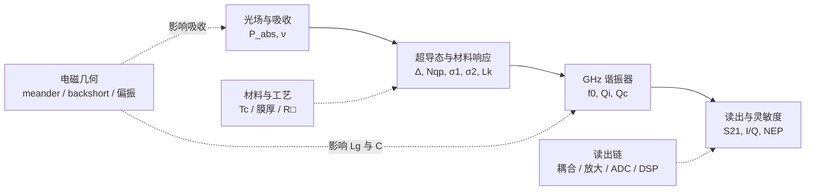
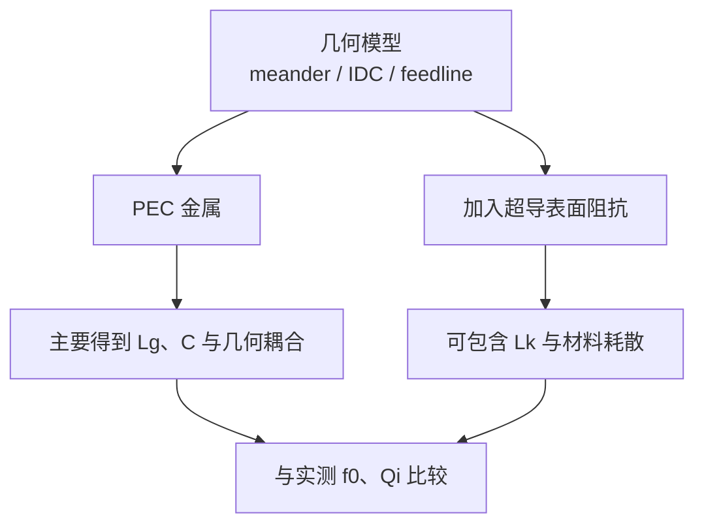
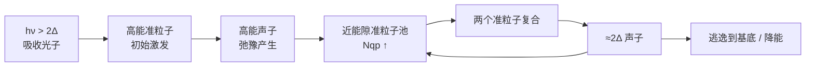

# KID 入门讲义 v0.3

**副标题：从“一个光子”到可读出的微波信号**  
**版本：v0.3 · 2026-09-04**

> 这不是一本“先学完凝聚态物理再碰器件”的教材。它采用器件设计者视角：**先建立可运行的物理图景，再逐层补上微观理论、公式、仿真与实验。**

---

## 如何使用这份讲义

这份讲义按“物理因果链”而不是按学科目录组织。每一章都尽量回答四个问题：

1. **发生了什么？** —— 先建立可视化的物理图景；
2. **为什么？** —— 用最少但必要的公式把直觉固定下来；
3. **怎么测？** —— 把物理量连接到真实实验中的 IQ、$S_{21}$、频移和噪声；
4. **与 LEKID 设计有什么关系？** —— 把材料、几何、电磁仿真和读出重新接回同一条链。

当前 v0.3 在 v0.2 的基础上继续完成：
- 保留完整的 KID 入门学习路线与统一图示规范；
- 保留“从光子到 $S_{21}$”和“动能电感”两章；
- 新增“超导基础最小知识集”：Cooper pair、BCS 能隙、准粒子与热激发；
- 新增 generation–recombination、quasiparticle lifetime，以及材料 $T_c$ 与 150 GHz pair-breaking threshold 的直接设计联系。

### v0.3 延续的图示约定

- **实线箭头**：只表示因果关系或真实信号流；
- **虚线箭头**：表示“某个设计参数会影响另一个物理量”；
- **无箭头连线/分组框**：表示结构组成或互易耦合，不暗示单向因果。

这样可以避免把“结构连接”“信号流”“因果链”混成一种箭头。

---

# 第 1 章：KID 入门的总体路线图

## 1. 最终要学会的是一张闭环图

最终知识应闭合成一条主因果链：



对应的主链仍可压缩为：

$$
P_{\rm abs},\nu
ightarrow N_{qp}
ightarrow(\sigma_1,\sigma_2,L_k)
ightarrow(f_0,Q_i)
ightarrow S_{21}
ightarrow I,Q.
$$

同时，LEKID 的几何、材料和读出链从不同位置进入这条链。

你最终应能回答：
- 改变膜厚，为什么会影响吸收、$L_k$、$Q_i$ 和 responsivity？
- 加 backshort，为什么主要先改变毫米波吸收，却最终体现在 GHz 读出端的 IQ 上？
- 为什么同样一个 $S_{21}$ notch，可能对应完全不同的光学效率？

## 2. 建议学习模块

| 模块 | 核心主题 | 学完后应该能回答的问题 | 典型产出 |
|---|---|---|---|
| M1 | 从光子到 $S_{21}$ | KID 到底怎样把光变成可测的 IQ 变化？ | 因果链 + 极简仿真 |
| M2 | 超导基础 | Cooper pair、能隙、准粒子到底是什么？ | BCS 最小知识集 |
| M3 | 动能电感与复电导 | 为什么超导载流子的惯性等效为电感？ | $L_k$ 推导 + MB 框架 |
| M4 | 微波谐振器 | $Q_i,Q_c,Q_r$、耦合和 IQ 圆分别意味着什么？ | resonator fitting |
| M5 | 光学响应 | 光功率如何映射为 $\Delta f_0$、相位和幅度？ | responsivity 模型 |
| M6 | 噪声与 NEP | photon noise、TLS、GR、放大器噪声如何比较？ | noise budget |
| M7 | LEKID 电磁设计 | meander、IDC、偏振、backshort 如何设计？ | 参数化像素模型 |
| M8 | 阵列与读出 | 如何频分复用大量像素？ | readout budget |
| M9 | 仿真与实验 | Sonnet/CST/测量数据各自验证哪一层物理？ | 仿真-测量闭环 |
| M10 | 研究课题化 | 如何从“能工作的 KID”走向可发表问题？ | 论文验证矩阵 |

推荐顺序：

$$
\boxed{
\text{可视化因果链}
\rightarrow
\text{等效电路}
\rightarrow
\text{最小超导理论}
\rightarrow
\text{复电导}
\rightarrow
\text{噪声与光学}
\rightarrow
\text{LEKID 工程设计}
}
$$

---

# 第 2 章：从一个光子到 $S_{21}$ —— KID 的第一性物理图景

## 学习目标

学完本章后，你应该能不看资料独立讲清：

1. 为什么毫米波/亚毫米波光子能够改变超导薄膜；
2. 为什么这种变化会改变 kinetic inductance 和 microwave loss；
3. 为什么谐振频率与品质因数因此改变；
4. 为什么实验最终读到的是 $S_{21}=I+jQ$；
5. 一颗 LEKID 为什么可以同时扮演“光学吸收器”和“GHz 微波谐振器”。

## 1. KID 是一台“两种频率协同工作”的机器

KID 中通常同时存在两类信号：

- **被探测信号**：例如 150 GHz 毫米波；
- **读出探针**：例如 1–5 GHz 微波。

最核心的因果链：

$$
\boxed{
P_{\rm opt}
\rightarrow N_{qp}
\rightarrow (L_k,Q_i)
\rightarrow (f_0,Q_r)
\rightarrow S_{21}
\rightarrow I,Q
}
$$

**物理直觉：信号光子负责“改变器件”，GHz 探针微波负责“询问器件”。**

```mermaid
flowchart LR
    A[150 GHz 信号辐射] --> B[meander 薄膜吸收]
    B --> C[Nqp ↑]
    C --> D[Lk, Qi, f0 改变]

    E[GHz probe tone] --> F[feedline + KID<br/>测量 S21]
    F --> G[低噪声放大 / ADC / DDC]
    G --> H[I(t), Q(t)]

    D -.决定 S21(f).-> F
```

这里两条“频率通道”不要混淆：上面是被探测光对器件状态的因果链，下面是读出微波的真实信号流。

---

## 2. 第一站：光子必须有足够的能量

光子能量：

$$
E_\gamma=h\nu.
$$

150 GHz 光子：

$$
E_\gamma\approx 9.94\times10^{-23}\,\mathrm J\approx0.620\,\mathrm{meV}.
$$

弱耦合 BCS 近似下：

$$
\Delta(0)\approx1.764k_BT_c.
$$

破坏一个 Cooper pair 需要产生两个准粒子，因此最基本阈值：

$$
\boxed{h\nu\ge2\Delta.}
$$

对应：

$$
\nu_{\rm pb}=\frac{2\Delta}{h}\approx73.5\,\mathrm{GHz/K}\times T_c.
$$

若铝 $T_c\approx1.2\,\mathrm K$：

$$
\nu_{\rm pb}\approx88\,\mathrm{GHz}.
$$

因此 150 GHz 高于阈值，具备直接 pair breaking 的能力。

> **常见误区**：“$h\nu>\Delta$ 就能打碎 Cooper pair。”不准确。pair breaking 的最基本阈值是 $2\Delta$。

---

## 3. 第二站：Cooper pair 被破坏，准粒子增加

第一遍只保留三个对象：

- **Cooper-pair condensate**：超导凝聚态；
- **energy gap $\Delta$**：激发准粒子的能量尺度；
- **quasiparticle**：超导体系的激发态，会改变微波耗散和复电导。

最简过程：

$$
\gamma + \text{Cooper pair}\rightarrow qp+qp.
$$

真实过程中还会有高能准粒子弛豫、声子产生和二次 pair breaking。

对于连续光照，更好的描述是：

$$
\frac{dN_{qp}}{dt}=G-R.
$$

因此通常：

$$
P_{\rm opt}\uparrow \Rightarrow G\uparrow \Rightarrow N_{qp}\uparrow.
$$

天文 LEKID 更适合记成：

$$
\boxed{P_{\rm opt}\rightarrow N_{qp}}
$$

而不是单纯“一颗光子对应一个脉冲”。

---

## 4. 第三站：为什么会影响 kinetic inductance？

电流意味着载流子有定向运动。载流子有质量，因此改变速度需要能量。对交流电流而言，这部分能量会周期性储存和释放，从端口看形成电感型响应。

最简惯性模型给出：

$$
L_k\propto\frac1{n_s}.
$$

所以：

$$
\boxed{
N_{qp}\uparrow
\Rightarrow
n_s\downarrow
\Rightarrow
L_k\uparrow
}
$$

总电感：

$$
L=L_g+L_k.
$$

三种储能可这样区分：

| 量 | 主要储能位置 | 直觉 |
|---|---|---|
| $C$ | 电场 | 电荷分离 |
| $L_g$ | 导体周围磁场 | 电流建立磁场 |
| $L_k$ | 超导载流子集体动能 | 载流子具有惯性 |

定义 kinetic inductance fraction：

$$
\boxed{\alpha=\frac{L_k}{L_g+L_k}.}
$$

$\alpha$ 表示总电感中有多大比例来自“对超导状态敏感”的那部分。

---

## 5. 第四站：$L_k$ 如何变成谐振频移？

LEKID 最简 LC 模型：

$$
\boxed{f_0=\frac1{2\pi\sqrt{LC}}.}
$$

若光照主要改变 $L_k$：

$$
\frac{\delta f_0}{f_0}=-\frac12\frac{\delta L}{L}.
$$

利用 $\delta L=\delta L_k$ 与 $\alpha=L_k/L$：

$$
\boxed{
\frac{\delta f_0}{f_0}
=-\frac{\alpha}{2}\frac{\delta L_k}{L_k}.
}
$$

因此通常：

$$
L_k\uparrow\Rightarrow f_0\downarrow.
$$

---

## 6. 第五站：准粒子同时增加微波耗散

光照不仅改变 kinetic inductance，还通常导致：

$$
N_{qp}\uparrow\Rightarrow\text{loss}\uparrow\Rightarrow Q_i\downarrow.
$$

所以光照通常同时造成：

$$
\boxed{f_0\text{ 改变}+Q_i\text{ 改变}.}
$$

更微观地，超导薄膜在微波频率下用复电导：

$$
\boxed{\sigma=\sigma_1-i\sigma_2.}
$$

第一遍可先记：

- $\sigma_1$：与耗散相关；
- $\sigma_2$：与感性/超流响应相关。

后续 Mattis–Bardeen 理论会把“频移”和“损耗变化”统一起来。

---

## 7. 第六站：为什么实验最终测 $S_{21}$？

KID 耦合到微波 feedline。读出系统发送 GHz 信号并测：

$$
\boxed{S_{21}(f)=\frac{V_{\rm out}}{V_{\rm in}}.}
$$

一个简化 notch resonator：

$$
S_{21}(f)=1-\frac{Q_r/Q_c}{1+2jQ_r\dfrac{f-f_0}{f_0}},
$$

且：

$$
\boxed{\frac1{Q_r}=\frac1{Q_i}+\frac1{Q_c}.}
$$

- $Q_i$：内部损耗；
- $Q_c$：与 feedline 的耦合；
- $Q_r$：实际观测到的 loaded Q。

扫频用于找到/标定谐振器；真实时间序列读出常固定：

$$
f_{\rm probe}\approx f_0,
$$

持续测：

$$
\boxed{S_{21}(t)=I(t)+jQ(t).}
$$

光照使 resonance 轻微移动，固定 probe tone 相对 resonance 的位置改变，于是 IQ 发生变化。

---

## 8. 为什么读出微波通常不直接 pair break？

设计上常希望：

$$
h\nu_{\rm readout}<2\Delta,
$$

而：

$$
h\nu_{\rm signal}>2\Delta.
$$

所以低频 readout photon 通常不能直接 pair break，而高频信号光子可以。

> **注意**：这不意味着读出功率可以无限增大。过高功率仍可能引起非线性、加热和准粒子状态变化。

---

## 9. LEKID 的关键：同一块 meander 做两份工作

LEKID 的 meander 往往同时是：

1. **毫米波/亚毫米波 absorber**：入射场在薄膜中驱动高频电流并沉积能量；
2. **GHz resonator 的 inductor**：其 $L_g+L_k$ 与 IDC 共同决定微波共振。

因此，毫米波光学设计和 GHz 谐振器设计并不是两个独立问题，而是通过同一块超导薄膜耦合。

### 映射到 150 GHz 双偏振 LEKID

以后每看一个几何结构都问两遍：

- **光学问题**：它如何改变 150 GHz 场、电流分布、吸收和偏振选择性？
- **读出问题**：它如何改变 $L_g,L_k,C,f_0,Q_i,Q_c$ 和可读出性？

---

## 10. 一张因果链地图

```mermaid
flowchart TD
    A[hν > 2Δ<br/>信号功率被薄膜吸收] --> B[Cooper pair 被激发/破坏<br/>Nqp ↑]
    B --> C[复电导与表面阻抗改变<br/>σ1, σ2 改变]
    C --> D1[感性支路<br/>Lk ↑]
    C --> D2[耗散支路<br/>loss ↑, Qi ↓]
    D1 --> E[谐振器响应改变<br/>f0 移动，notch 形状改变]
    D2 --> E
    E --> F[固定 GHz probe tone<br/>所见 S21(t) 改变]
    F --> G[I(t), Q(t)<br/>数字后端估计光学信号]
```

---

## 11. 本章公式阶梯

1. $E_\gamma=h\nu$
2. $h\nu\ge2\Delta$, $\Delta(0)\approx1.764k_BT_c$
3. $L_k\propto1/n_s$
4. $f_0=1/(2\pi\sqrt{LC})$, $L=L_g+L_k$
5. $\delta f_0/f_0=-(\alpha/2)(\delta L_k/L_k)$
6. $1/Q_r=1/Q_i+1/Q_c$
7. $S_{21}=I+jQ$

---

## 12. 六个常见误区

1. **KID 直接测光子的电信号。** —— 不对，光先改变超导材料，再改变谐振器。
2. **$h\nu>\Delta$ 就能 pair break。** —— 基本阈值是 $2\Delta$。
3. **Kinetic inductance 就是 meander 几何形成的电感。** —— 不对，几何主要影响 $L_g$，$L_k$ 来自载流子惯性。
4. **光照只会让 resonance 左移。** —— 不完整，也通常会改变损耗与 $Q_i$。
5. **KID 工作时必须一直扫频。** —— 扫频用于定位/标定，时间序列常用固定 probe tone。
6. **读出功率越大越好。** —— 不对，过强驱动会造成非线性和加热等问题。

---

## 13. Day 1：3–4 小时任务

| 时间 | 任务 | 完成标准 |
|---|---|---|
| 35 min | 手画“光子 → IQ”因果链 | 不看讲义可口述完整链条 |
| 45 min | 重算 Al 的 $\Delta,2\Delta,\nu_{pb}$ 和 150 GHz 光子能量 | 能判断频率是否满足 pair breaking |
| 55 min | 从 LC 共振推导 $\delta f_0/f_0$，理解 $\alpha$ | 推导不用背结果 |
| 60 min | Python 画 $|S_{21}|$ 与 IQ 圆，并模拟 $f_0$ 左移 | 得到至少 3 张图 |
| 30 min | 阅读 Day 2003 摘要/图 1 | 能指出论文中真正的被测量量 |
| 20 min | 闭卷回答下方 8 题 | 至少 6 题能解释“为什么” |

## 14. 闭卷理解检查

1. 为什么 pair-breaking threshold 是 $2\Delta$？
2. 为什么 150 GHz 对 Al 是合理的 pair-breaking 频率，而 5 GHz 通常不是？
3. $N_{qp}$ 增加后为什么不能只讨论 $L_k$ 而忽略 $Q_i$？
4. $L_g$ 与 $L_k$ 的能量分别储在哪里？
5. 为什么 $L_k$ 增加通常导致 $f_0$ 降低？
6. 什么是 $Q_i,Q_c,Q_r$？
7. 为什么实际观测可以固定 probe tone，而不必一直扫频？
8. 用一句完整的话解释：LEKID 的 meander 为什么同时是 absorber 和 resonator inductor？

---

## 本章的一句话

> **KID 用高于能隙阈值的光改变超导薄膜的准粒子与复电导，再用高 Q 微波谐振器把这种微小变化转成可精确测量的 $S_{21}=I+jQ$ 变化。**

---


---

# 第 3 章：动能电感——为什么“载流子的惯性”会变成一个可测的电感？

## 学习目标

这一章只解决一个核心问题：**为什么超导载流子的运动惯性可以从器件端口看成一个电感 $L_k$？**

学完后应能：

1. 从 $m^*dv/dt=q^*E$ 独立推到均匀超导条带的 $L_k$；
2. 用能量法再次得到同一个结果；
3. 理解 London penetration depth $\lambda_L$ 与 $L_k$ 的关系；
4. 把三维电感化成薄膜中常用的 sheet kinetic inductance $L_{k,\Box}$；
5. 判断长度、线宽、膜厚、超流密度怎样改变 $L_k$；
6. 理解 kinetic inductance fraction $\alpha$ 为什么控制频率转导；
7. 知道把超导金属简单设成 PEC 时会漏掉哪一层物理。

## 3.1 电感并不只有一种储能机制

对于 LEKID 的 meander：

$$
L=L_g+L_k.
$$

| 元件/电感 | 主要储能位置 | 典型形式 |
|---|---|---|
| $C$ | 电场 | $U_E=\tfrac12CV^2$ |
| $L_g$ | 导体周围磁场 | $U_B=\tfrac12L_gI^2$ |
| $L_k$ | 超导载流子的集体动能 | $U_k=\tfrac12L_kI^2$ |

> **关键直觉**：meander 弯得很多会显著改变几何电感 $L_g$，但 kinetic inductance 的根源不是“弯曲”，而是**有质量的超导载流子被交流电场加速**。一根完全笔直的超导条带同样有 $L_k$。

## 3.2 第一条推导：从载流子惯性到 $V=L_k\,dI/dt$

令有效超导载流子的质量、电荷和数密度分别为 $m^*$、$q^*$、$n_s$。忽略散射：

$$
m^*\frac{dv}{dt}=q^*E.
$$

电流密度：

$$
J=n_sq^*v.
$$

因此：

$$
\frac{dJ}{dt}
=n_sq^*\frac{dv}{dt}
=\frac{n_s(q^*)^2}{m^*}E.
$$

所以：

$$
\boxed{E=\frac{m^*}{n_s(q^*)^2}\frac{dJ}{dt}}.
$$

考虑长度 $l$、宽度 $w$、膜厚 $t$ 的均匀条带：

$$
A=wt,
\qquad
J=\frac IA,
\qquad
V=El.
$$

代入：

$$
V=rac{m^*l}{n_s(q^*)^2wt}\frac{dI}{dt}.
$$

与

$$
V=L\frac{dI}{dt}
$$

比较，得到：

$$
\boxed{L_k=\frac{m^*l}{n_s(q^*)^2wt}}.
$$

### 关于 $2e$、$2m_e$ 与 $n_s$

有的教材把 $n_s$ 定义为 Cooper-pair density，此时用 $q^*=2e$、$m^*\approx2m_e$；有的教材把 $n_s$ 定义为参与超流的电子密度，此时使用 $e,m_e$。**只要密度定义和电荷/质量定义保持一致，结果是一致的。**不要把两套约定混用。

## 3.3 第二条推导：能量法

体积 $Al$ 中载流子的总动能：

$$
U_k=\frac12(n_sAl)m^*v^2.
$$

而

$$
I=n_sq^*vA
\quad\Rightarrow\quad
v=\frac{I}{n_sq^*A}.
$$

代回：

$$
U_k
=\frac12\frac{m^*l}{n_s(q^*)^2A}I^2.
$$

电感储能定义：

$$
U_L=\frac12LI^2.
$$

所以再次得到：

$$
\boxed{L_k=\frac{m^*l}{n_s(q^*)^2A}}.
$$

这说明 kinetic inductance 不是“人为塞进等效电路”的参数，而是载流子动能在端口层面的等效表示。

## 3.4 从公式直接读出工程趋势

$$
L_k=\frac{m^*l}{n_s(q^*)^2wt}.
$$

因此在最简单均匀电流模型里：

- $l\uparrow\Rightarrow L_k\uparrow$；
- $w\downarrow\Rightarrow L_k\uparrow$；
- $t\downarrow\Rightarrow L_k\uparrow$；
- $n_s\downarrow\Rightarrow L_k\uparrow$。

```mermaid
flowchart LR
    A[几何旋钮<br/>l ↑, w ↓, t ↓] -.-> C[Lk ↑]
    B[材料/状态<br/>ns ↓] -.-> C
    C --> D[α = Lk/(Lg+Lk)<br/>通常增大]
    D --> E[相同材料扰动<br/>产生更大 |δf0|]
```

> **常见误区**：“线越窄、膜越薄一定越好。”不成立。这样虽然可能提高 $L_k$ 与频率响应，但会同时改变毫米波表面阻抗匹配、临界电流、非线性、工艺均匀性、损耗和 $Q_i$。

## 3.5 London penetration depth

London 理论给出：

$$
\boxed{\lambda_L^2=\frac{m^*}{\mu_0n_s(q^*)^2}}.
$$

因此：

$$
\boxed{L_k=\mu_0\lambda_L^2\frac{l}{wt}}.
$$

于是得到直观链条：

$$
n_s\downarrow
\Longleftrightarrow
\lambda_L\uparrow
\Longleftrightarrow
L_k\uparrow.
$$

$\lambda_L$ 同时描述场在超导体中的穿透/屏蔽长度尺度。以后学习复电导与表面阻抗时，会看到 $\lambda$、$\sigma_2$、$L_k$ 是同一感性物理的不同语言。

## 3.6 每方块动能电感 $L_{k,\Box}$

若薄膜足够薄，厚度方向电流近似均匀：

$$
L_k
=\mu_0\lambda_L^2\frac{l}{wt}
=\left(\mu_0\frac{\lambda_L^2}{t}\right)\frac lw.
$$

定义：

$$
\boxed{L_{k,\Box}\equiv\mu_0\frac{\lambda_L^2}{t}}
\qquad (t\ll\lambda_L\text{ 的简单 London 极限})
$$

以及“方块数”：

$$
N_{\Box}=\frac lw,
$$

就有：

$$
\boxed{L_k\approx L_{k,\Box}N_{\Box}}.
$$

“per square” 很适合平面器件，因为 $l/w$ 没有量纲。真实 meander 中的弯角 current crowding、邻近线磁耦合和非均匀电流会让这个简单估算产生偏差，因此它适合**手算和设计直觉**，不替代全波求解。

### 膜不再很薄时

局域 London 模型下，更一般的表面感性可写成：

$$
L_s\approx\mu_0\lambda\coth\left(\frac t\lambda\right).
$$

当 $t\ll\lambda$：

$$
L_s\approx\mu_0\frac{\lambda^2}{t}.
$$

真实 KID 薄膜还会受到 dirty limit、温度和频率影响，这些后续交给 Mattis–Bardeen 框架处理。

## 3.7 一个示意数值

取示意参数：

$$
\lambda_{\rm eff}=200\,\mathrm{nm},
\qquad
t=20\,\mathrm{nm}.
$$

得到：

$$
L_{k,\Box}
=\mu_0\frac{\lambda_{\rm eff}^2}{t}
\approx2.5\,\mathrm{pH}/\Box.
$$

如果 meander 有约 $1000$ squares：

$$
L_k\sim2.5\,\mathrm{nH}.
$$

这只是量级示例，不代表某种具体 Al 薄膜的真实材料参数。

## 3.8 从 $L_k$ 到 $\alpha$

定义：

$$
\boxed{\alpha=\frac{L_k}{L_g+L_k}}.
$$

若扰动主要改变 $L_k$：

$$
\frac{\delta f_0}{f_0}
=-\frac12\frac{\delta L_k}{L_g+L_k}
=-\frac{\alpha}{2}\frac{\delta L_k}{L_k}.
$$

所以：

$$
\boxed{\frac{\delta f_0}{f_0}=-\frac{\alpha}{2}\frac{\delta L_k}{L_k}}.
$$

$\alpha$ 可以理解为**超导材料状态变化进入总谐振器电感的权重**。$L_g$ 太大时，材料变化会被“不敏感的几何电感”稀释。

## 3.9 映射到你的 150 GHz 双偏振 LEKID

meander 的线宽、总路径长度和膜厚至少同时参与：

1. 150 GHz 的表面电流分布与吸收匹配；
2. 几何电感 $L_g$；
3. kinetic inductance $L_k$；
4. kinetic inductance fraction $\alpha$；
5. 因而影响同一超导态扰动造成的 $\delta f_0/f_0$。

所以“把 meander 线做细一点”绝不是单纯的 GHz 调频动作，也不是单纯的毫米波吸收动作，而是在同时改动两个频率域。

## 3.10 对 Sonnet/CST 的直接提醒：PEC 会漏掉什么？

如果把超导薄膜完全当作 PEC，仿真仍然可以得到：

- 几何电容和大部分 $L_g$；
- 电流路径、耦合、辐射等几何效应；
- 相应模型下的毫米波场分布。

但理想 PEC 没有真实超导薄膜的表面感抗，因此不会自动包含真实的 $L_k$ 和材料耗散。



因此以后 resonance 与实测对不上时，不能第一时间只归咎于几何：**几何电感、电容、动能电感、材料损耗和工艺偏差都可能推动 $f_0$。**

## 3.11 本章暂时没有展开的内容

这一版故意还没有完整推导：

- BCS 中 $n_s(T)$ 与 $N_{qp}(T)$ 的严格关系；
- dirty-limit 薄膜常用结果 $L_{k,\Box}\approx\hbar R_{\Box}/(\pi\Delta)$；
- $\sigma_1-i\sigma_2$ 与 surface impedance 的严格关系；
- Mattis–Bardeen 积分与有限频率、有限温度修正。

## 3.12 公式阶梯

1. $m^*dv/dt=q^*E$
2. $J=n_sq^*v$
3. $L_k=m^*l/[n_s(q^*)^2wt]$
4. $\lambda_L^2=m^*/[\mu_0n_s(q^*)^2]$
5. $L_{k,\Box}\approx\mu_0\lambda_L^2/t$
6. $L_k\approx L_{k,\Box}(l/w)$
7. $\alpha=L_k/(L_g+L_k)$
8. $\delta f_0/f_0=-(\alpha/2)(\delta L_k/L_k)$

## 3.13 60–90 分钟任务

1. 不看讲义，从 $m\,dv/dt=qE$ 推到 $L_k$；
2. 用能量法再推一次；
3. Python 扫描 $L_g=8\,\mathrm{nH}$、$L_k=0.5$ 到 $8\,\mathrm{nH}$，画 $\alpha$ 和 $f_0$；
4. 固定 $\delta L_k/L_k=10^{-4}$，画 $\alpha$ 从 0 到 1 时 $|\delta f_0/f_0|$；
5. 用一句话回答：**为什么 KID 不是“几何电感探测器”？**

## 3.14 闭卷理解检查

1. 一根完全笔直的超导条带有没有 kinetic inductance？
2. $L_g$ 与 $L_k$ 分别把能量储存在哪里？
3. 为什么 $L_k\propto1/n_s$？
4. 把线宽减半，在简单模型里 $L_k$ 怎么变？
5. 什么叫“每方块电感”？
6. 为什么 PEC 仿真可以给出 resonance，却仍可能把真实 $f_0$ 算偏？
7. $\alpha$ 大意味着什么？为什么它不是“越大越好”的唯一目标？


# 第 4 章：超导基础最小知识集 —— Cooper pair、能隙与准粒子

## 学习目标

这一章不试图把 BCS 理论从头推完。目标是建立一套足够支撑 KID 设计的“最小超导语言”。学完后，你应该能回答：

1. 普通金属与超导态在“可激发的低能状态”上有什么本质区别？
2. Cooper pair 为什么不能简单理解成两个紧紧抱在一起的电子？
3. 能隙 $\Delta$、临界温度 $T_c$ 与 pair-breaking 阈值之间是什么关系？
4. 什么是 quasiparticle（准粒子），为什么 KID 真正关心的是 $N_{qp}$？
5. 为什么热准粒子在低温下呈指数压低，而真实器件仍可能存在 excess quasiparticles？
6. pair breaking、recombination（复合）与 quasiparticle lifetime（准粒子寿命）如何决定 KID 的响应速度与灵敏度？

---

## 4.1 为什么现在才补“超导基础”？

前两章我们已经知道：

$$
P_{\rm abs}\rightarrow N_{qp}\rightarrow L_k,Q_i\rightarrow f_0,S_{21}.
$$

第 3 章又从载流子惯性推出了 $L_k$。但这里一直有一个“黑箱”：

$$
\boxed{\text{光子为什么会让 }N_{qp}\text{ 增加？}\qquad N_{qp}\text{ 到底是什么？}}
$$

本章就是打开这个黑箱。对 KID 设计者来说，最重要的不是会写完整 BCS gap equation，而是建立：

$$
\boxed{
T_c\rightarrow\Delta(T)
\rightarrow
\text{准粒子可激发能量}
\rightarrow
N_{qp}(T,P_{\rm abs})
\rightarrow
\tau_{qp}
\rightarrow
L_k,Q_i,S_{21}
}
$$

**物理直觉：**把超导体想成一个“低能激发被能隙挡住的电子系统”。KID 用毫米波/亚毫米波制造少量准粒子，再用 GHz 谐振器灵敏地读出这些准粒子改变了多少复电导。

---

## 4.2 正常金属与超导态：区别不只是“电阻变成零”

### 正常金属

在金属中，电子填充到 Fermi energy（费米能）$E_F$ 附近。只要提供很小的能量，就可以在 $E_F$ 附近制造电子–空穴激发。交流电流中的电子还不断受到晶格、杂质和缺陷散射，因此产生耗散。

可以先记：

$$
\boxed{\text{正常金属在 }E_F\text{ 附近很容易被激发。}}
$$

### 超导态

常规超导体降到 $T_c$ 以下后，费米面附近的一部分电子形成 Cooper pairs，并进入具有宏观相干相位的配对基态。

关键不是“电子从此不碰撞”，而是：

> **体系的低能激发谱被重构，并出现 energy gap（能隙）$\Delta$。**

对 BCS 准粒子：

$$
E=\sqrt{\xi^2+\Delta^2},\qquad \xi=\varepsilon-E_F.
$$

所以当 $\xi=0$ 时，正常态可以有趋近零的激发能量，而超导态的准粒子最小激发能量是 $\Delta$。

---

## 4.3 Cooper pair：KID 需要掌握到什么程度？

最简单的常规 $s$ 波 BCS 图景中，常把一对电子写成：

$$
(\mathbf{k},\uparrow),\qquad(-\mathbf{k},\downarrow).
$$

即近似相反动量、相反自旋的配对。晶格声子介导的有效吸引可以使费米面附近的电子产生配对不稳定性。

但 Cooper pair **不是两个电子形成的局域小分子**。其空间尺度可以远大于晶格常数，大量 pair 高度重叠，形成集体的配对凝聚态。

因此“打碎一个 Cooper pair”更安全的理解是：

$$
\boxed{\text{从配对基态中制造两个准粒子激发}}
$$

而不是把它想象成机械地掰断一根两电子化学键。

> **常见误区：**“Cooper pair 的结合能就是 $2\Delta$。”  
> 对 KID 更稳妥的表述是：单个最低能准粒子激发至少需要 $\Delta$；制造两个最低能准粒子，因此 pair-breaking threshold 约为 $2\Delta$。

---

## 4.4 BCS 能隙 $\Delta$：把材料与探测频率连接起来

弱耦合 BCS 在零温给出：

$$
\boxed{\Delta_0\approx1.764k_BT_c.}
$$

当 $T\to T_c$：

$$
\Delta(T)\to0.
$$

工程画图常使用 BCS-like 插值：

$$
\Delta(T)\approx
\Delta_0\tanh\!\left[
1.74\sqrt{\frac{T_c}{T}-1}
\right].
$$

它是方便的插值，不是完整 gap equation 本身。

### pair-breaking threshold

要制造两个最低能准粒子：

$$
\boxed{h\nu_{\rm pb}\approx2\Delta.}
$$

低温弱耦合近似下：

$$
\boxed{
\nu_{\rm pb}(0)
\approx
73.5\ {\rm GHz/K}\times T_c.
}
$$

| 材料 | 代表性 $T_c$ (K) | $\Delta_0$ (meV) | $\nu_{\rm pb}$ (GHz) | 150 GHz 直接 pair break? |
|---|---:|---:|---:|---|
| Ti | 0.4 | 0.061 | 29 | 是 |
| Al | 1.2 | 0.182 | 88 | 是 |
| Nb | 9.2 | 1.40 | 676 | 否 |
| NbTiN | 14 | 2.13 | 1029 | 否 |

这些只是弱耦合公式和代表性 $T_c$ 的数量级估算。真实薄膜会受材料配比、膜厚、沉积工艺和强耦合修正影响。

### 映射到 150 GHz LEKID

若吸收膜近似为 Al，$T_c\sim1.2$ K：

$$
\nu_{\rm pb}\sim88\ {\rm GHz}.
$$

所以 150 GHz 高于阈值；而 1–5 GHz readout tone 远低于阈值。这正是“高频光改变器件、低频微波询问器件”的材料基础。

---

## 4.5 准粒子：不是普通电子，而是超导体系的激发

BCS quasiparticle 能量：

$$
\boxed{
E_{\mathbf{k}}=\sqrt{\xi_{\mathbf{k}}^2+\Delta^2}
}
$$

所以：

$$
E_{\mathbf{k}}\ge\Delta.
$$

更严格地说，Bogoliubov quasiparticle 是电子与空穴自由度的量子叠加。KID 入门阶段暂时不需要推 Bogoliubov transformation，但要避免把 quasiparticle 简化成“从 Cooper pair 里掉出来的普通电子”。

理想 BCS $s$ 波超导体的归一化态密度：

$$
\frac{N_s(E)}{N_0}
=
\begin{cases}
0, & |E|<\Delta,\\
\dfrac{|E|}{\sqrt{E^2-\Delta^2}}, & |E|>\Delta.
\end{cases}
$$

能隙内部没有理想单粒子激发态，并在 $|E|=\Delta$ 附近出现 coherence peak。这也是后面 Mattis–Bardeen 积分为什么总围绕 $\Delta$ 附近状态展开的根源。

---

## 4.6 热准粒子：为什么降温如此有效？

准粒子热占据：

$$
f(E,T)=\frac{1}{e^{E/k_BT}+1}.
$$

当 $k_BT\ll\Delta$：

$$
\boxed{
n_{qp}^{\rm th}
\approx
2N_0\sqrt{2\pi k_BT\Delta}
e^{-\Delta/k_BT}
}
$$

其中 $N_0$ 是 normal-state Fermi level 处的 single-spin density of states（单自旋态密度）。

最重要的是指数项：

$$
\boxed{n_{qp}^{\rm th}\propto e^{-\Delta/k_BT}.}
$$

如果取 $\Delta\simeq\Delta_0=1.764k_BT_c$：

| $T/T_c$ | $n_{qp}^{\rm th}/(2N_0\Delta_0)$ |
|---:|---:|
| 0.10 | $1.3\times10^{-8}$ |
| 0.20 | $1.25\times10^{-4}$ |
| 0.30 | $2.9\times10^{-3}$ |
| 0.50 | $3.9\times10^{-2}$ |

因此讨论 KID 工作温度时，最好同时看：

$$
\boxed{T/T_c}
$$

而不只是“冰箱是多少 mK”。

### 为什么真实器件仍会有 excess quasiparticles？

理想热平衡公式只是 baseline。真实器件还可能受到：

- 外界毫米波、红外、黑体泄漏；
- 宇宙线、高能粒子或基底声子；
- readout power 引起的加热与非平衡分布；
- 材料缺陷、陷阱和复杂的声子动力学。

因此实际系统里 $T\to0$ 并不自动保证 $N_{qp}\to0$。

---

## 4.7 光子如何制造非平衡准粒子？



高能声子可能继续 pair break，因此一个高能光子不一定只对应两个最终准粒子。

常用 pair-breaking efficiency $\eta_{\rm pb}$ 概括吸收能量进入低能准粒子系统的比例：

$$
N_{qp}^{\rm excess}
\sim
\eta_{\rm pb}\frac{E_{\rm abs}}{\Delta}.
$$

连续光功率可用数量级关系：

$$
\boxed{
G_{\rm opt}
\sim
\eta_{\rm pb}\frac{P_{\rm abs}}{\Delta}.
}
$$

精确系数取决于非平衡能量级联、声子逃逸和材料。

---

## 4.8 recombination：为什么准粒子不会一直积累？

两个准粒子可以重新进入 Cooper-pair condensate，并释放约 $2\Delta$ 的声子能量。

最小教学模型：

$$
\boxed{
\frac{dN_{qp}}{dt}
=
G-\mathcal{R}N_{qp}^2.
}
$$

稳态：

$$
G=\mathcal{R}N_{qp,\rm ss}^2,
$$

因此：

$$
\boxed{
N_{qp,\rm ss}
=
\sqrt{\frac{G}{\mathcal{R}}}.
}
$$

真实超导薄膜通常需要 Rothwarf–Taylor 方程或 Kaplan 的电子–声子寿命理论；这里的 $G-\mathcal RN^2$ 只是为了理解“稳态”和“复合为何随 $N_{qp}$ 增快”。

---

## 4.9 准粒子寿命 $\tau_{qp}$：连接到探测器速度

稳态附近的小扰动常可写成：

$$
\boxed{
\delta N_{qp}(t)=
\delta N_{qp}(0)e^{-t/\tau_{qp}}.
}
$$

对简化模型线性化：

$$
\tau_{qp}\sim
\frac{1}{2\mathcal{R}N_{qp,\rm ss}}.
$$

如果只有一个主导一阶时间常数：

$$
f_{\rm 3dB}\sim\frac{1}{2\pi\tau_{qp}}.
$$

KID 还有谐振器 ring-down time：

$$
\boxed{
\tau_{\rm res}=
\frac{Q_r}{\pi f_0}.
}
$$

真实时域响应同时受到 $\tau_{qp}$ 和 $\tau_{\rm res}$ 约束。

**重要直觉：**较长的 $\tau_{qp}$ 往往意味着同样的持续光功率能积累更多准粒子，有利于 responsivity；但响应也更慢。

---

## 4.10 材料选择的核心轴

以后谈材料时，同时比较两个无量纲量：

$$
\boxed{\frac{T}{T_c}}
\qquad\text{和}\qquad
\boxed{\frac{h\nu}{2\Delta}}.
$$

- $T/T_c$ 控制 thermal quasiparticle baseline 的数量级；
- $h\nu/2\Delta$ 决定入射光是否满足直接 pair breaking 的能量条件。

因此：

- 降低 $T_c$：降低 pair-breaking threshold，并往往提高 kinetic-inductance sensitivity；
- 但同样 bath temperature 下 $T/T_c$ 会变大，热准粒子更难压低；
- 提高 $T_c$：热稳定和低损耗可能更好，但目标光可能根本达不到 $2\Delta$。

所以“$T_c$ 越低越好”或“越高越好”都不成立。

---

## 4.11 映射到当前 150 GHz 双偏振 LEKID

建议以后每次谈材料参数，都同时写：

$$
T_c,\quad
\Delta_0,\quad
\nu_{\rm pb}=\frac{2\Delta_0}{h},\quad
T/T_c.
$$

若使用 Al 类低能隙吸收膜：

- 150 GHz 通常高于 pair-breaking threshold；
- GHz readout tone 单个光子远低于 $2\Delta$，通常不会直接 pair break；
- 但过高 readout power 仍可能通过加热、非平衡分布、多光子过程或电流非线性改变准粒子系统。

如果只用 Nb/NbTiN 一类高 $T_c$ 材料作吸收体，150 GHz 可能低于直接 pair-breaking threshold。因此实际超导探测器中会出现“高能隙材料负责低损耗微波结构、低能隙材料负责吸收/准粒子产生”的混合材料思路。

---

## 4.12 七个常见误区

1. **Cooper pair 就是两个电子形成的小分子。**  
   不对。BCS pair 是高度重叠的集体量子配对结构。
2. **超导无电阻是因为电子不再散射。**  
   过度简化。关键是配对凝聚态与有能隙的激发谱。
3. **$\Delta$ 就是打碎一对电子所需的全部能量。**  
   单个最低能准粒子至少需要 $\Delta$，制造两个准粒子的门槛约为 $2\Delta$。
4. **只要 $h\nu>2\Delta$，吸收效率就一定高。**  
   错。阈值只说明能量允许 pair breaking；吸收仍取决于 sheet impedance、几何、偏振和 backshort。
5. **温度足够低，$N_{qp}$ 一定严格趋近零。**  
   真实器件可能被外界辐射、基底声子和读出功率维持在非平衡底噪。
6. **读出频率低于 $2\Delta/h$，所以 readout power 与超导状态无关。**  
   错。单个光子不能直接 pair break，不代表强微波场不会加热或引起非线性。
7. **$T_c$ 越低，KID 一定越灵敏。**  
   不成立。还要考虑工作温度、热准粒子、损耗、工艺、$\alpha$、噪声和光学匹配。

---

## 4.13 本章公式阶梯

$$
\boxed{\Delta_0\approx1.764k_BT_c}
$$

$$
\boxed{h\nu_{\rm pb}\approx2\Delta}
$$

$$
\boxed{E_{\mathbf{k}}=\sqrt{\xi_{\mathbf{k}}^2+\Delta^2}}
$$

$$
\boxed{
n_{qp}^{\rm th}
\approx
2N_0\sqrt{2\pi k_BT\Delta}
e^{-\Delta/k_BT}
}
$$

$$
\boxed{
\frac{dN_{qp}}{dt}=G-\mathcal RN_{qp}^2
}
$$

$$
\boxed{
\delta N_{qp}(t)\propto e^{-t/\tau_{qp}}
}
$$

最终重新接回：

$$
\boxed{
N_{qp}
\rightarrow
\sigma_1,\sigma_2
\rightarrow
L_k,Q_i
\rightarrow
S_{21}
}
$$

下一版将正式打开中间这一步：Mattis–Bardeen 与 surface impedance。

---

## 4.14 90–120 分钟任务

1. 写函数用 $T_c$ 计算 $\Delta_0$ 和 $\nu_{\rm pb}$，代入 Ti、Al、Nb、NbTiN；
2. 画 $\Delta(T)/\Delta_0$ 对 $T/T_c$ 的 BCS-like 插值；
3. 画 $n_{qp}^{\rm th}/(2N_0\Delta_0)$ 对 $T/T_c$ 的半对数图；
4. 数值积分 $dN/dt=G-\mathcal RN^2$，从不同初值观察其收敛到同一 steady state；
5. 画 $\tau_{qp}=10\,\mu$s、$100\,\mu$s、$1$ ms 的恢复曲线；
6. 闭卷回答：为什么 KID 材料选择必须同时考虑 $T/T_c$ 与 $h\nu/2\Delta$？

---

## 4.15 闭卷理解检查

1. 普通金属和超导态在低能激发谱上最关键的区别是什么？
2. Cooper pair 为什么不能简单理解成两颗局域电子？
3. 为什么 pair-breaking threshold 约为 $2\Delta$？
4. 若 $T_c$ 增大一倍，$\Delta_0$ 和 $\nu_{\rm pb}$ 如何变化？
5. $n_{qp}^{\rm th}$ 为什么对温度极其敏感？
6. 为什么真实 KID 在极低温仍可能有 non-equilibrium quasiparticles？
7. generation 与 recombination 如何建立稳态？
8. $\tau_{qp}$ 为什么会进入 detector bandwidth？
9. 为什么 150 GHz 可以直接 pair break Al，却未必能直接 pair break NbTiN？
10. 为什么“读出光子低于 $2\Delta$”仍不代表 readout power 可以任意增加？

### 本章一句话

$$
\boxed{
T_c
\rightarrow
\Delta
\rightarrow
(N_{qp}^{\rm thermal}+N_{qp}^{\rm optical})
\rightarrow
\tau_{qp}
\rightarrow
\sigma_1,\sigma_2
\rightarrow
S_{21}
}
$$

# 后续版本计划

- v0.4：复电导、surface impedance 与 Mattis–Bardeen 的器件化理解
- v0.5：$Q_i/Q_c/Q_r$、notch resonator、IQ circle 与 fitting
- v0.6：optical responsivity、NEP 与 photon / GR / TLS / amplifier noise
- v0.7：LEKID absorber / IDC / coupling / polarization / backshort 电磁设计
- v0.8：映射到当前双偏振 150 GHz LEKID 项目与 Sonnet/CST 验证矩阵

# 建议参考资料

1. P. K. Day et al., “A broadband superconducting detector suitable for use in large arrays,” *Nature*, 425, 817–821 (2003).
2. S. Doyle, *Lumped Element Kinetic Inductance Detectors*, PhD thesis, Cardiff University (2008).
3. J. Zmuidzinas, “Superconducting Microresonators: Physics and Applications,” *Annual Review of Condensed Matter Physics*, 3, 169–214 (2012).
4. J. Gao, *The Physics of Superconducting Microwave Resonators*, PhD thesis, California Institute of Technology (2008).
5. M. Tinkham, *Introduction to Superconductivity*, 2nd ed., Dover Publications.
6. S. B. Kaplan et al., “Quasiparticle and phonon lifetimes in superconductors,” *Physical Review B*, 14, 4854–4873 (1976).
7. A. Rothwarf and B. N. Taylor, “Measurement of Recombination Lifetimes in Superconductors,” *Physical Review Letters*, 19, 27–30 (1967).
8. P. J. de Visser et al., generation–recombination / sparse quasiparticle fluctuation studies in superconducting resonators.
