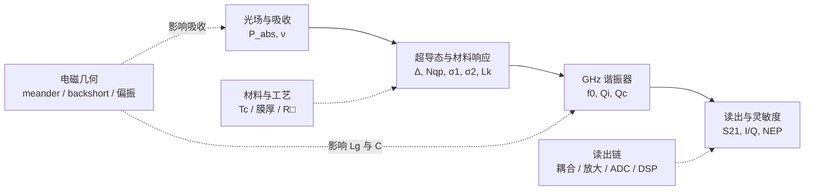
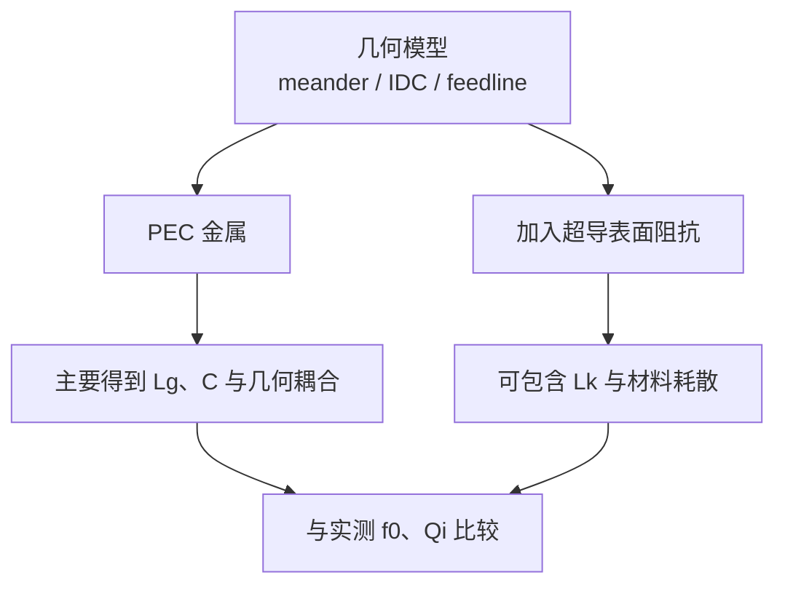
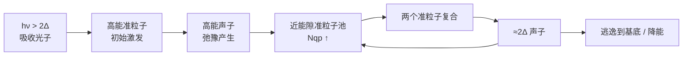

# KID 入门讲义 v0.10 — Step 2 结构预览

**副标题：从“一个光子”到可读出的微波信号**  
**版本：v0.10 Step 2 Preview · 2026-09-09**

> 这不是一本“先学完凝聚态物理再碰器件”的教材。它采用器件设计者视角：**先建立可运行的物理图景，再逐层补上微观理论、公式、仿真与实验。**

---

## 如何使用这份讲义

这份讲义按“**物理因果链**”组织。第一次阅读不要求先掌握超导或 KID 专用术语；先记住：

$$
\boxed{
\text{光}
\rightarrow
\text{超导状态变化}
\rightarrow
\text{谐振器变化}
\rightarrow
\text{微波读出变化}
}
$$

全书只是逐层解释这四个箭头。

### 三条阅读路线

- **路线 A｜完全初学者**：按第 0–10 章顺序阅读；第 11 章作为进阶工程案例。
- **路线 B｜已有 RF / 微波背景**：第 0–2 章 → 第 6 章 → 第 3–5 章 → 第 7–8 章 → 第 9–10 章。
- **路线 C｜主要目标是 LEKID 仿真与器件设计**：第 0–3 章 → 第 5、8 章 → 第 11 章；材料、读出和噪声章节按需回查。

如果一页出现太多陌生符号，先问：**它位于“光 → 超导状态 → 谐振器 → 微波读出”的哪一个箭头上？**


> **v0.10 Step 2 说明：** 本预览只完成“第 0 章 + Parts + 阅读路线 + LaTeX 章首导航卡”的架构重构；逐句口吻、术语统一、版本历史清理与版式细修将在后续 Step 3–5 完成。

---

# Part I：先建立 KID 直觉

# 第 0 章：第一次接触 KID，只需要先知道这些

> **为什么要学？** 完全陌生的读者需要先知道“这是什么器件、为什么有两个频段、最后究竟测什么”。  
> **阅读前只需要知道：** 频率、电压、电流和 LC 谐振的最基本概念。  
> **读完应能回答：** KID/LEKID 是什么；meander、IDC、feedline 做什么；notch 和 IQ 图代表什么。  
> **一句话结论：** **光负责改变超导谐振器，微波探针负责把这种改变读出来。**

## 0.1 先不看公式：KID 到底在做什么？

KID（kinetic inductance detector，动能电感探测器）不是让光直接产生一个容易读取的电压，而是让入射光先改变一个超导微波谐振器，再用很弱的微波探针读取这种变化。

最简单的四步：

```text
入射光 → 超导状态改变 → 谐振器改变 → S21 / I,Q 改变
```

可以暂时把 KID 想成一只“会被光轻微调音的微波谐振器”。

## 0.2 LEKID 像元里先认三个角色

- **meander（蛇形电感/吸收结构）**：毫米波吸收器，同时贡献 GHz 动能电感；
- **IDC（interdigitated capacitor，叉指电容）**：主要提供谐振器电容；
- **feedline（读出传输线）**：输送 GHz probe tone，并把受谐振器影响后的信号送回读出链。

## 0.3 为什么同时有 150 GHz 和几 GHz？

| | 被探测信号 | 读出微波 |
|---|---|---|
| 典型频率 | 例如 150 GHz | 例如 1–5 GHz |
| 任务 | 改变器件 | 询问器件 |
| 最终作用 | 改变准粒子、$L_k$ 和损耗 | 形成 $S_{21}$ 与 $I,Q$ |

**150 GHz 信号和 2 GHz 读出不是同一条波被降频。它们是职责不同的两条电磁通道。**

## 0.4 第一次看 VNA：notch 是什么？

VNA（vector network analyzer，矢量网络分析仪）扫过一段微波频率并测量 $S_{21}$。远离谐振时信号基本正常通过；靠近 $f_0$ 时出现一个传输凹口（notch）。光照会让这个凹口的位置和形状发生微小变化。

## 0.5 IQ 图是什么？

$S_{21}$ 是复数，可写成

$$
S_{21}=I+jQ.
$$

先把 $I$ 看成横坐标、$Q$ 看成纵坐标即可。扫频时每个频率对应 IQ 平面上的一个点；理想 notch 模型中，这些点形成一个圆。notch 图和 IQ 图描述的是**同一次扫频的两种视角**。

## 0.6 正式观测为什么通常不一直扫频？

扫频用于寻找并标定谐振器；正式读出通常把 probe tone 固定在谐振附近，连续记录

$$
\boxed{I(t),\;Q(t)}.
$$

## 0.7 现在不懂这些词很正常

Cooper pair、quasiparticle、$Q_i/Q_c/Q_r$、Mattis–Bardeen、NEP、TLS、backshort、waveguide mode、cross-pol 都会在后文展开。第 0 章的目标只是让这些词以后出现时有地方可以“挂上去”。

---

# 第 1 章：KID 入门的总体路线图

> **为什么要学？** 先看整张地图，避免后面学到 $L_k$、$Q$、NEP 或 backshort 时不知道它们为什么会出现在同一本书里。  
> **阅读前只需要知道：** 第 0 章四步直觉链。  
> **读完应能回答：** 怎样把材料、谐振器、读出、光学与电磁几何放回同一因果链。  
> **一句话结论：** **先知道每个知识块在地图上的位置，再进入细节。**

## 1. 最终要学会的是一张闭环图

最终知识应闭合成一条主因果链：



对应的主链仍可压缩为：

$$
P_{\rm abs},\nu
\rightarrow N_{qp}
\rightarrow(\sigma_1,\sigma_2,L_k)
\rightarrow(f_0,Q_i)
\rightarrow S_{21}
\rightarrow I,Q.
$$

同时，LEKID 的几何、材料和读出链从不同位置进入这条链。

你最终应能回答：
- 改变膜厚，为什么会影响吸收、$L_k$、$Q_i$ 和 responsivity？
- 加 backshort，为什么主要先改变毫米波吸收，却最终体现在 GHz 读出端的 IQ 上？
- 为什么同样一个 $S_{21}$ notch，可能对应完全不同的光学效率？

## 2. 建议学习模块

| 模块 | 核心主题 | 学完后应该能回答的问题 | 典型产出 |
|---|---|---|---|
| M1 | 从光子到 $S_{21}$ | KID 到底怎样把光变成可测的 IQ 变化？ | 因果链 + 极简仿真 |
| M2 | 超导基础 | Cooper pair、能隙、准粒子到底是什么？ | BCS 最小知识集 |
| M3 | 动能电感与复电导 | 为什么超导载流子的惯性等效为电感？ | $L_k$ 推导 + MB 框架 |
| M4 | 微波谐振器 | $Q_i,Q_c,Q_r$、耦合和 IQ 圆分别意味着什么？ | resonator fitting |
| M5 | 光学响应 | 光功率如何映射为 $\Delta f_0$、相位和幅度？ | responsivity 模型 |
| M6 | 噪声与 NEP | photon noise、TLS、GR、放大器噪声如何比较？ | noise budget |
| M7 | LEKID 电磁设计 | meander、IDC、偏振、backshort 如何设计？ | 参数化像素模型 |
| M8 | 阵列与读出 | 如何频分复用大量像素？ | readout budget |
| M9 | 仿真与实验 | Sonnet/CST/测量数据各自验证哪一层物理？ | 仿真-测量闭环 |
| M10 | 研究课题化 | 如何从“能工作的 KID”走向可发表问题？ | 论文验证矩阵 |

推荐顺序：

$$
\boxed{
\text{可视化因果链}
\rightarrow
\text{等效电路}
\rightarrow
\text{最小超导理论}
\rightarrow
\text{复电导}
\rightarrow
\text{噪声与光学}
\rightarrow
\text{LEKID 工程设计}
}
$$

---

# 第 2 章：从一个光子到 $S_{21}$ —— KID 的第一性物理图景

> **为什么要学？** 这是全书第一次把“光子 → 微波读出”完整走通。  
> **阅读前只需要知道：** 第 0–1 章、$E=h\nu$ 和 LC 谐振基本概念。  
> **读完应能回答：** 为什么光会改变 $L_k$ 与损耗，为什么最终读出 $S_{21}=I+jQ$。  
> **一句话结论：** **信号光改变器件状态，GHz 探针把这种状态变化转换成可测复数传输变化。**

## 学习目标

学完本章后，你应该能不看资料独立讲清：

1. 为什么毫米波/亚毫米波光子能够改变超导薄膜；
2. 为什么这种变化会改变 kinetic inductance 和 microwave loss；
3. 为什么谐振频率与品质因数因此改变；
4. 为什么实验最终读到的是 $S_{21}=I+jQ$；
5. 一颗 LEKID 为什么可以同时扮演“光学吸收器”和“GHz 微波谐振器”。

## 1. KID 是一台“两种频率协同工作”的机器

KID 中通常同时存在两类信号：

- **被探测信号**：例如 150 GHz 毫米波；
- **读出探针**：例如 1–5 GHz 微波。

最核心的因果链：

$$
\boxed{
P_{\rm opt}
\rightarrow N_{qp}
\rightarrow (L_k,Q_i)
\rightarrow (f_0,Q_r)
\rightarrow S_{21}
\rightarrow I,Q
}
$$

**物理直觉：信号光子负责“改变器件”，GHz 探针微波负责“询问器件”。**

```mermaid
flowchart LR
    A[150 GHz 信号辐射] --> B[meander 薄膜吸收]
    B --> C[Nqp ↑]
    C --> D[Lk, Qi, f0 改变]

    E[GHz probe tone] --> F[feedline + KID<br/>测量 S21]
    F --> G[低噪声放大 / ADC / DDC]
    G --> H[I(t), Q(t)]

    D -.决定 S21(f).-> F
```

这里两条“频率通道”不要混淆：上面是被探测光对器件状态的因果链，下面是读出微波的真实信号流。

---

## 2. 第一站：光子必须有足够的能量

光子能量：

$$
E_\gamma=h\nu.
$$

150 GHz 光子：

$$
E_\gamma\approx 9.94\times10^{-23}\,\mathrm J\approx0.620\,\mathrm{meV}.
$$

弱耦合 BCS 近似下：

$$
\Delta(0)\approx1.764k_BT_c.
$$

破坏一个 Cooper pair 需要产生两个准粒子，因此最基本阈值：

$$
\boxed{h\nu\ge2\Delta.}
$$

对应：

$$
\nu_{\rm pb}=\frac{2\Delta}{h}\approx73.5\,\mathrm{GHz/K}\times T_c.
$$

若铝 $T_c\approx1.2\,\mathrm K$：

$$
\nu_{\rm pb}\approx88\,\mathrm{GHz}.
$$

因此 150 GHz 高于阈值，具备直接 pair breaking 的能力。

> **常见误区**：“$h\nu>\Delta$ 就能打碎 Cooper pair。”不准确。pair breaking 的最基本阈值是 $2\Delta$。

---

## 3. 第二站：Cooper pair 被破坏，准粒子增加

第一遍只保留三个对象：

- **Cooper-pair condensate**：超导凝聚态；
- **energy gap $\Delta$**：激发准粒子的能量尺度；
- **quasiparticle**：超导体系的激发态，会改变微波耗散和复电导。

最简过程：

$$
\gamma + \text{Cooper pair}\rightarrow qp+qp.
$$

真实过程中还会有高能准粒子弛豫、声子产生和二次 pair breaking。

对于连续光照，更好的描述是：

$$
\frac{dN_{qp}}{dt}=G-R.
$$

因此通常：

$$
P_{\rm opt}\uparrow \Rightarrow G\uparrow \Rightarrow N_{qp}\uparrow.
$$

天文 LEKID 更适合记成：

$$
\boxed{P_{\rm opt}\rightarrow N_{qp}}
$$

而不是单纯“一颗光子对应一个脉冲”。

---

## 4. 第三站：为什么会影响 kinetic inductance？

电流意味着载流子有定向运动。载流子有质量，因此改变速度需要能量。对交流电流而言，这部分能量会周期性储存和释放，从端口看形成电感型响应。

最简惯性模型给出：

$$
L_k\propto\frac1{n_s}.
$$

所以：

$$
\boxed{
N_{qp}\uparrow
\Rightarrow
n_s\downarrow
\Rightarrow
L_k\uparrow
}
$$

总电感：

$$
L=L_g+L_k.
$$

三种储能可这样区分：

| 量 | 主要储能位置 | 直觉 |
|---|---|---|
| $C$ | 电场 | 电荷分离 |
| $L_g$ | 导体周围磁场 | 电流建立磁场 |
| $L_k$ | 超导载流子集体动能 | 载流子具有惯性 |

定义 kinetic inductance fraction：

$$
\boxed{\alpha=\frac{L_k}{L_g+L_k}.}
$$

$\alpha$ 表示总电感中有多大比例来自“对超导状态敏感”的那部分。

---

## 5. 第四站：$L_k$ 如何变成谐振频移？

LEKID 最简 LC 模型：

$$
\boxed{f_0=\frac1{2\pi\sqrt{LC}}.}
$$

若光照主要改变 $L_k$：

$$
\frac{\delta f_0}{f_0}=-\frac12\frac{\delta L}{L}.
$$

利用 $\delta L=\delta L_k$ 与 $\alpha=L_k/L$：

$$
\boxed{
\frac{\delta f_0}{f_0}
=-\frac{\alpha}{2}\frac{\delta L_k}{L_k}.
}
$$

因此通常：

$$
L_k\uparrow\Rightarrow f_0\downarrow.
$$

---

## 6. 第五站：准粒子同时增加微波耗散

光照不仅改变 kinetic inductance，还通常导致：

$$
N_{qp}\uparrow\Rightarrow\text{loss}\uparrow\Rightarrow Q_i\downarrow.
$$

所以光照通常同时造成：

$$
\boxed{f_0\text{ 改变}+Q_i\text{ 改变}.}
$$

更微观地，超导薄膜在微波频率下用复电导：

$$
\boxed{\sigma=\sigma_1-i\sigma_2.}
$$

第一遍可先记：

- $\sigma_1$：与耗散相关；
- $\sigma_2$：与感性/超流响应相关。

后续 Mattis–Bardeen 理论会把“频移”和“损耗变化”统一起来。

---

## 7. 第六站：为什么实验最终测 $S_{21}$？

KID 耦合到微波 feedline。读出系统发送 GHz 信号并测：

$$
\boxed{S_{21}(f)=\frac{V_{\rm out}}{V_{\rm in}}.}
$$

一个简化 notch resonator：

$$
S_{21}(f)=1-\frac{Q_r/Q_c}{1+2jQ_r\dfrac{f-f_0}{f_0}},
$$

且：

$$
\boxed{\frac1{Q_r}=\frac1{Q_i}+\frac1{Q_c}.}
$$

- $Q_i$：内部损耗；
- $Q_c$：与 feedline 的耦合；
- $Q_r$：实际观测到的 loaded Q。

扫频用于找到/标定谐振器；真实时间序列读出常固定：

$$
f_{\rm probe}\approx f_0,
$$

持续测：

$$
\boxed{S_{21}(t)=I(t)+jQ(t).}
$$

光照使 resonance 轻微移动，固定 probe tone 相对 resonance 的位置改变，于是 IQ 发生变化。

---

## 8. 为什么读出微波通常不直接 pair break？

设计上常希望：

$$
h\nu_{\rm readout}<2\Delta,
$$

而：

$$
h\nu_{\rm signal}>2\Delta.
$$

所以低频 readout photon 通常不能直接 pair break，而高频信号光子可以。

> **注意**：这不意味着读出功率可以无限增大。过高功率仍可能引起非线性、加热和准粒子状态变化。

---

## 9. LEKID 的关键：同一块 meander 做两份工作

LEKID 的 meander 往往同时是：

1. **毫米波/亚毫米波 absorber**：入射场在薄膜中驱动高频电流并沉积能量；
2. **GHz resonator 的 inductor**：其 $L_g+L_k$ 与 IDC 共同决定微波共振。

因此，毫米波光学设计和 GHz 谐振器设计并不是两个独立问题，而是通过同一块超导薄膜耦合。

### 映射到 150 GHz 双偏振 LEKID

以后每看一个几何结构都问两遍：

- **光学问题**：它如何改变 150 GHz 场、电流分布、吸收和偏振选择性？
- **读出问题**：它如何改变 $L_g,L_k,C,f_0,Q_i,Q_c$ 和可读出性？

---

## 10. 一张因果链地图

```mermaid
flowchart TD
    A[hν > 2Δ<br/>信号功率被薄膜吸收] --> B[Cooper pair 被激发/破坏<br/>Nqp ↑]
    B --> C[复电导与表面阻抗改变<br/>σ1, σ2 改变]
    C --> D1[感性支路<br/>Lk ↑]
    C --> D2[耗散支路<br/>loss ↑, Qi ↓]
    D1 --> E[谐振器响应改变<br/>f0 移动，notch 形状改变]
    D2 --> E
    E --> F[固定 GHz probe tone<br/>所见 S21(t) 改变]
    F --> G[I(t), Q(t)<br/>数字后端估计光学信号]
```

---

## 11. 本章公式阶梯

1. $E_\gamma=h\nu$
2. $h\nu\ge2\Delta$, $\Delta(0)\approx1.764k_BT_c$
3. $L_k\propto1/n_s$
4. $f_0=1/(2\pi\sqrt{LC})$, $L=L_g+L_k$
5. $\delta f_0/f_0=-(\alpha/2)(\delta L_k/L_k)$
6. $1/Q_r=1/Q_i+1/Q_c$
7. $S_{21}=I+jQ$

---

## 12. 六个常见误区

1. **KID 直接测光子的电信号。** —— 不对，光先改变超导材料，再改变谐振器。
2. **$h\nu>\Delta$ 就能 pair break。** —— 基本阈值是 $2\Delta$。
3. **Kinetic inductance 就是 meander 几何形成的电感。** —— 不对，几何主要影响 $L_g$，$L_k$ 来自载流子惯性。
4. **光照只会让 resonance 左移。** —— 不完整，也通常会改变损耗与 $Q_i$。
5. **KID 工作时必须一直扫频。** —— 扫频用于定位/标定，时间序列常用固定 probe tone。
6. **读出功率越大越好。** —— 不对，过强驱动会造成非线性和加热等问题。

---

## 13. Day 1：3–4 小时任务

| 时间 | 任务 | 完成标准 |
|---|---|---|
| 35 min | 手画“光子 → IQ”因果链 | 不看讲义可口述完整链条 |
| 45 min | 重算 Al 的 $\Delta,2\Delta,\nu_{pb}$ 和 150 GHz 光子能量 | 能判断频率是否满足 pair breaking |
| 55 min | 从 LC 共振推导 $\delta f_0/f_0$，理解 $\alpha$ | 推导不用背结果 |
| 60 min | Python 画 $|S_{21}|$ 与 IQ 圆，并模拟 $f_0$ 左移 | 得到至少 3 张图 |
| 30 min | 阅读 Day 2003 摘要/图 1 | 能指出论文中真正的被测量量 |
| 20 min | 闭卷回答下方 8 题 | 至少 6 题能解释“为什么” |

## 14. 闭卷理解检查

1. 为什么 pair-breaking threshold 是 $2\Delta$？
2. 为什么 150 GHz 对 Al 是合理的 pair-breaking 频率，而 5 GHz 通常不是？
3. $N_{qp}$ 增加后为什么不能只讨论 $L_k$ 而忽略 $Q_i$？
4. $L_g$ 与 $L_k$ 的能量分别储在哪里？
5. 为什么 $L_k$ 增加通常导致 $f_0$ 降低？
6. 什么是 $Q_i,Q_c,Q_r$？
7. 为什么实际观测可以固定 probe tone，而不必一直扫频？
8. 用一句完整的话解释：LEKID 的 meander 为什么同时是 absorber 和 resonator inductor？

---

## 本章的一句话

> **KID 用高于能隙阈值的光改变超导薄膜的准粒子与复电导，再用高 Q 微波谐振器把这种微小变化转成可精确测量的 $S_{21}=I+jQ$ 变化。**

---


---

# Part II：超导材料与微波谐振器

# Part II：超导材料与微波谐振器

# 第 3 章：动能电感——为什么“载流子的惯性”会变成一个可测的电感？

> **为什么要学？** KID 名字里的 kinetic inductance 是探测链的核心，不理解它就无法解释频移。  
> **阅读前只需要知道：** 电流、电场、$V=L\,dI/dt$ 和 LC 谐振直觉。  
> **读完应能回答：** 为什么载流子惯性产生 $L_k$，以及 $n_s$、几何和 $L_{k,\Box}$ 怎样影响器件。  
> **一句话结论：** **超流载流子的惯性提供了一种可被光间接调制的电感。**

## 学习目标

这一章只解决一个核心问题：**为什么超导载流子的运动惯性可以从器件端口看成一个电感 $L_k$？**

学完后应能：

1. 从 $m^*dv/dt=q^*E$ 独立推到均匀超导条带的 $L_k$；
2. 用能量法再次得到同一个结果；
3. 理解 London penetration depth $\lambda_L$ 与 $L_k$ 的关系；
4. 把三维电感化成薄膜中常用的 sheet kinetic inductance $L_{k,\Box}$；
5. 判断长度、线宽、膜厚、超流密度怎样改变 $L_k$；
6. 理解 kinetic inductance fraction $\alpha$ 为什么控制频率转导；
7. 知道把超导金属简单设成 PEC 时会漏掉哪一层物理。

## 3.1 电感并不只有一种储能机制

对于 LEKID 的 meander：

$$
L=L_g+L_k.
$$

| 元件/电感 | 主要储能位置 | 典型形式 |
|---|---|---|
| $C$ | 电场 | $U_E=\tfrac12CV^2$ |
| $L_g$ | 导体周围磁场 | $U_B=\tfrac12L_gI^2$ |
| $L_k$ | 超导载流子的集体动能 | $U_k=\tfrac12L_kI^2$ |

> **关键直觉**：meander 弯得很多会显著改变几何电感 $L_g$，但 kinetic inductance 的根源不是“弯曲”，而是**有质量的超导载流子被交流电场加速**。一根完全笔直的超导条带同样有 $L_k$。

## 3.2 第一条推导：从载流子惯性到 $V=L_k\,dI/dt$

令有效超导载流子的质量、电荷和数密度分别为 $m^*$、$q^*$、$n_s$。忽略散射：

$$
m^*\frac{dv}{dt}=q^*E.
$$

电流密度：

$$
J=n_sq^*v.
$$

因此：

$$
\frac{dJ}{dt}
=n_sq^*\frac{dv}{dt}
=\frac{n_s(q^*)^2}{m^*}E.
$$

所以：

$$
\boxed{E=\frac{m^*}{n_s(q^*)^2}\frac{dJ}{dt}}.
$$

考虑长度 $l$、宽度 $w$、膜厚 $t$ 的均匀条带：

$$
A=wt,
\qquad
J=\frac IA,
\qquad
V=El.
$$

代入：

$$
V=\frac{m^*l}{n_s(q^*)^2wt}\frac{dI}{dt}.
$$

与

$$
V=L\frac{dI}{dt}
$$

比较，得到：

$$
\boxed{L_k=\frac{m^*l}{n_s(q^*)^2wt}}.
$$

### 关于 $2e$、$2m_e$ 与 $n_s$

有的教材把 $n_s$ 定义为 Cooper-pair density，此时用 $q^*=2e$、$m^*\approx2m_e$；有的教材把 $n_s$ 定义为参与超流的电子密度，此时使用 $e,m_e$。**只要密度定义和电荷/质量定义保持一致，结果是一致的。**不要把两套约定混用。

## 3.3 第二条推导：能量法

体积 $Al$ 中载流子的总动能：

$$
U_k=\frac12(n_sAl)m^*v^2.
$$

而

$$
I=n_sq^*vA
\quad\Rightarrow\quad
v=\frac{I}{n_sq^*A}.
$$

代回：

$$
U_k
=\frac12\frac{m^*l}{n_s(q^*)^2A}I^2.
$$

电感储能定义：

$$
U_L=\frac12LI^2.
$$

所以再次得到：

$$
\boxed{L_k=\frac{m^*l}{n_s(q^*)^2A}}.
$$

这说明 kinetic inductance 不是“人为塞进等效电路”的参数，而是载流子动能在端口层面的等效表示。

## 3.4 从公式直接读出工程趋势

$$
L_k=\frac{m^*l}{n_s(q^*)^2wt}.
$$

因此在最简单均匀电流模型里：

- $l\uparrow\Rightarrow L_k\uparrow$；
- $w\downarrow\Rightarrow L_k\uparrow$；
- $t\downarrow\Rightarrow L_k\uparrow$；
- $n_s\downarrow\Rightarrow L_k\uparrow$。

```mermaid
flowchart LR
    A[几何旋钮<br/>l ↑, w ↓, t ↓] -.-> C[Lk ↑]
    B[材料/状态<br/>ns ↓] -.-> C
    C --> D[α = Lk/(Lg+Lk)<br/>通常增大]
    D --> E[相同材料扰动<br/>产生更大 |δf0|]
```

> **常见误区**：“线越窄、膜越薄一定越好。”不成立。这样虽然可能提高 $L_k$ 与频率响应，但会同时改变毫米波表面阻抗匹配、临界电流、非线性、工艺均匀性、损耗和 $Q_i$。

## 3.5 London penetration depth

London 理论给出：

$$
\boxed{\lambda_L^2=\frac{m^*}{\mu_0n_s(q^*)^2}}.
$$

因此：

$$
\boxed{L_k=\mu_0\lambda_L^2\frac{l}{wt}}.
$$

于是得到直观链条：

$$
n_s\downarrow
\Longleftrightarrow
\lambda_L\uparrow
\Longleftrightarrow
L_k\uparrow.
$$

$\lambda_L$ 同时描述场在超导体中的穿透/屏蔽长度尺度。以后学习复电导与表面阻抗时，会看到 $\lambda$、$\sigma_2$、$L_k$ 是同一感性物理的不同语言。

## 3.6 每方块动能电感 $L_{k,\Box}$

若薄膜足够薄，厚度方向电流近似均匀：

$$
L_k
=\mu_0\lambda_L^2\frac{l}{wt}
=\left(\mu_0\frac{\lambda_L^2}{t}\right)\frac lw.
$$

定义：

$$
\boxed{L_{k,\Box}\equiv\mu_0\frac{\lambda_L^2}{t}}
\qquad (t\ll\lambda_L\text{ 的简单 London 极限})
$$

以及“方块数”：

$$
N_{\Box}=\frac lw,
$$

就有：

$$
\boxed{L_k\approx L_{k,\Box}N_{\Box}}.
$$

“per square” 很适合平面器件，因为 $l/w$ 没有量纲。真实 meander 中的弯角 current crowding、邻近线磁耦合和非均匀电流会让这个简单估算产生偏差，因此它适合**手算和设计直觉**，不替代全波求解。

### 膜不再很薄时

局域 London 模型下，更一般的表面感性可写成：

$$
L_s\approx\mu_0\lambda\coth\left(\frac t\lambda\right).
$$

当 $t\ll\lambda$：

$$
L_s\approx\mu_0\frac{\lambda^2}{t}.
$$

真实 KID 薄膜还会受到 dirty limit、温度和频率影响，这些后续交给 Mattis–Bardeen 框架处理。

## 3.7 一个示意数值

取示意参数：

$$
\lambda_{\rm eff}=200\,\mathrm{nm},
\qquad
t=20\,\mathrm{nm}.
$$

得到：

$$
L_{k,\Box}
=\mu_0\frac{\lambda_{\rm eff}^2}{t}
\approx2.5\,\mathrm{pH}/\Box.
$$

如果 meander 有约 $1000$ squares：

$$
L_k\sim2.5\,\mathrm{nH}.
$$

这只是量级示例，不代表某种具体 Al 薄膜的真实材料参数。

## 3.8 从 $L_k$ 到 $\alpha$

定义：

$$
\boxed{\alpha=\frac{L_k}{L_g+L_k}}.
$$

若扰动主要改变 $L_k$：

$$
\frac{\delta f_0}{f_0}
=-\frac12\frac{\delta L_k}{L_g+L_k}
=-\frac{\alpha}{2}\frac{\delta L_k}{L_k}.
$$

所以：

$$
\boxed{\frac{\delta f_0}{f_0}=-\frac{\alpha}{2}\frac{\delta L_k}{L_k}}.
$$

$\alpha$ 可以理解为**超导材料状态变化进入总谐振器电感的权重**。$L_g$ 太大时，材料变化会被“不敏感的几何电感”稀释。

## 3.9 映射到你的 150 GHz 双偏振 LEKID

meander 的线宽、总路径长度和膜厚至少同时参与：

1. 150 GHz 的表面电流分布与吸收匹配；
2. 几何电感 $L_g$；
3. kinetic inductance $L_k$；
4. kinetic inductance fraction $\alpha$；
5. 因而影响同一超导态扰动造成的 $\delta f_0/f_0$。

所以“把 meander 线做细一点”绝不是单纯的 GHz 调频动作，也不是单纯的毫米波吸收动作，而是在同时改动两个频率域。

## 3.10 对 Sonnet/CST 的直接提醒：PEC 会漏掉什么？

如果把超导薄膜完全当作 PEC，仿真仍然可以得到：

- 几何电容和大部分 $L_g$；
- 电流路径、耦合、辐射等几何效应；
- 相应模型下的毫米波场分布。

但理想 PEC 没有真实超导薄膜的表面感抗，因此不会自动包含真实的 $L_k$ 和材料耗散。



因此以后 resonance 与实测对不上时，不能第一时间只归咎于几何：**几何电感、电容、动能电感、材料损耗和工艺偏差都可能推动 $f_0$。**

## 3.11 本章暂时没有展开的内容

这一版故意还没有完整推导：

- BCS 中 $n_s(T)$ 与 $N_{qp}(T)$ 的严格关系；
- dirty-limit 薄膜常用结果 $L_{k,\Box}\approx\hbar R_{\Box}/(\pi\Delta)$；
- $\sigma_1-i\sigma_2$ 与 surface impedance 的严格关系；
- Mattis–Bardeen 积分与有限频率、有限温度修正。

## 3.12 公式阶梯

1. $m^*dv/dt=q^*E$
2. $J=n_sq^*v$
3. $L_k=m^*l/[n_s(q^*)^2wt]$
4. $\lambda_L^2=m^*/[\mu_0n_s(q^*)^2]$
5. $L_{k,\Box}\approx\mu_0\lambda_L^2/t$
6. $L_k\approx L_{k,\Box}(l/w)$
7. $\alpha=L_k/(L_g+L_k)$
8. $\delta f_0/f_0=-(\alpha/2)(\delta L_k/L_k)$

## 3.13 60–90 分钟任务

1. 不看讲义，从 $m\,dv/dt=qE$ 推到 $L_k$；
2. 用能量法再推一次；
3. Python 扫描 $L_g=8\,\mathrm{nH}$、$L_k=0.5$ 到 $8\,\mathrm{nH}$，画 $\alpha$ 和 $f_0$；
4. 固定 $\delta L_k/L_k=10^{-4}$，画 $\alpha$ 从 0 到 1 时 $|\delta f_0/f_0|$；
5. 用一句话回答：**为什么 KID 不是“几何电感探测器”？**

## 3.14 闭卷理解检查

1. 一根完全笔直的超导条带有没有 kinetic inductance？
2. $L_g$ 与 $L_k$ 分别把能量储存在哪里？
3. 为什么 $L_k\propto1/n_s$？
4. 把线宽减半，在简单模型里 $L_k$ 怎么变？
5. 什么叫“每方块电感”？
6. 为什么 PEC 仿真可以给出 resonance，却仍可能把真实 $f_0$ 算偏？
7. $\alpha$ 大意味着什么？为什么它不是“越大越好”的唯一目标？


# 第 4 章：超导基础最小知识集 —— Cooper pair、能隙与准粒子

> **为什么要学？** 这一章打开“光到底改变了超导薄膜内部什么”的微观黑箱。  
> **阅读前只需要知道：** 第 2–3 章的主因果链。  
> **读完应能回答：** Cooper pair、能隙、准粒子、pair breaking 和 $\tau_{qp}$ 分别是什么。  
> **一句话结论：** **KID 关心的是能量怎样改变准粒子人口，以及这种改变能维持多久。**

## 学习目标

这一章不试图把 BCS 理论从头推完。目标是建立一套足够支撑 KID 设计的“最小超导语言”。学完后，你应该能回答：

1. 普通金属与超导态在“可激发的低能状态”上有什么本质区别？
2. Cooper pair 为什么不能简单理解成两个紧紧抱在一起的电子？
3. 能隙 $\Delta$、临界温度 $T_c$ 与 pair-breaking 阈值之间是什么关系？
4. 什么是 quasiparticle（准粒子），为什么 KID 真正关心的是 $N_{qp}$？
5. 为什么热准粒子在低温下呈指数压低，而真实器件仍可能存在 excess quasiparticles？
6. pair breaking、recombination（复合）与 quasiparticle lifetime（准粒子寿命）如何决定 KID 的响应速度与灵敏度？

---

## 4.1 为什么现在才补“超导基础”？

前两章我们已经知道：

$$
P_{\rm abs}\rightarrow N_{qp}\rightarrow L_k,Q_i\rightarrow f_0,S_{21}.
$$

第 3 章又从载流子惯性推出了 $L_k$。但这里一直有一个“黑箱”：

$$
\boxed{\text{光子为什么会让 }N_{qp}\text{ 增加？}\qquad N_{qp}\text{ 到底是什么？}}
$$

本章就是打开这个黑箱。对 KID 设计者来说，最重要的不是会写完整 BCS gap equation，而是建立：

$$
\boxed{
T_c\rightarrow\Delta(T)
\rightarrow
\text{准粒子可激发能量}
\rightarrow
N_{qp}(T,P_{\rm abs})
\rightarrow
\tau_{qp}
\rightarrow
L_k,Q_i,S_{21}
}
$$

**物理直觉：**把超导体想成一个“低能激发被能隙挡住的电子系统”。KID 用毫米波/亚毫米波制造少量准粒子，再用 GHz 谐振器灵敏地读出这些准粒子改变了多少复电导。

---

## 4.2 正常金属与超导态：区别不只是“电阻变成零”

### 正常金属

在金属中，电子填充到 Fermi energy（费米能）$E_F$ 附近。只要提供很小的能量，就可以在 $E_F$ 附近制造电子–空穴激发。交流电流中的电子还不断受到晶格、杂质和缺陷散射，因此产生耗散。

可以先记：

$$
\boxed{\text{正常金属在 }E_F\text{ 附近很容易被激发。}}
$$

### 超导态

常规超导体降到 $T_c$ 以下后，费米面附近的一部分电子形成 Cooper pairs，并进入具有宏观相干相位的配对基态。

关键不是“电子从此不碰撞”，而是：

> **体系的低能激发谱被重构，并出现 energy gap（能隙）$\Delta$。**

对 BCS 准粒子：

$$
E=\sqrt{\xi^2+\Delta^2},\qquad \xi=\varepsilon-E_F.
$$

所以当 $\xi=0$ 时，正常态可以有趋近零的激发能量，而超导态的准粒子最小激发能量是 $\Delta$。

---

## 4.3 Cooper pair：KID 需要掌握到什么程度？

最简单的常规 $s$ 波 BCS 图景中，常把一对电子写成：

$$
(\mathbf{k},\uparrow),\qquad(-\mathbf{k},\downarrow).
$$

即近似相反动量、相反自旋的配对。晶格声子介导的有效吸引可以使费米面附近的电子产生配对不稳定性。

但 Cooper pair **不是两个电子形成的局域小分子**。其空间尺度可以远大于晶格常数，大量 pair 高度重叠，形成集体的配对凝聚态。

因此“打碎一个 Cooper pair”更安全的理解是：

$$
\boxed{\text{从配对基态中制造两个准粒子激发}}
$$

而不是把它想象成机械地掰断一根两电子化学键。

> **常见误区：**“Cooper pair 的结合能就是 $2\Delta$。”  
> 对 KID 更稳妥的表述是：单个最低能准粒子激发至少需要 $\Delta$；制造两个最低能准粒子，因此 pair-breaking threshold 约为 $2\Delta$。

---

## 4.4 BCS 能隙 $\Delta$：把材料与探测频率连接起来

弱耦合 BCS 在零温给出：

$$
\boxed{\Delta_0\approx1.764k_BT_c.}
$$

当 $T\to T_c$：

$$
\Delta(T)\to0.
$$

工程画图常使用 BCS-like 插值：

$$
\Delta(T)\approx
\Delta_0\tanh\!\left[
1.74\sqrt{\frac{T_c}{T}-1}
\right].
$$

它是方便的插值，不是完整 gap equation 本身。

### pair-breaking threshold

要制造两个最低能准粒子：

$$
\boxed{h\nu_{\rm pb}\approx2\Delta.}
$$

低温弱耦合近似下：

$$
\boxed{
\nu_{\rm pb}(0)
\approx
73.5\ {\rm GHz/K}\times T_c.
}
$$

| 材料 | 代表性 $T_c$ (K) | $\Delta_0$ (meV) | $\nu_{\rm pb}$ (GHz) | 150 GHz 直接 pair break? |
|---|---:|---:|---:|---|
| Ti | 0.4 | 0.061 | 29 | 是 |
| Al | 1.2 | 0.182 | 88 | 是 |
| Nb | 9.2 | 1.40 | 676 | 否 |
| NbTiN | 14 | 2.13 | 1029 | 否 |

这些只是弱耦合公式和代表性 $T_c$ 的数量级估算。真实薄膜会受材料配比、膜厚、沉积工艺和强耦合修正影响。

### 映射到 150 GHz LEKID

若吸收膜近似为 Al，$T_c\sim1.2$ K：

$$
\nu_{\rm pb}\sim88\ {\rm GHz}.
$$

所以 150 GHz 高于阈值；而 1–5 GHz readout tone 远低于阈值。这正是“高频光改变器件、低频微波询问器件”的材料基础。

---

## 4.5 准粒子：不是普通电子，而是超导体系的激发

BCS quasiparticle 能量：

$$
\boxed{
E_{\mathbf{k}}=\sqrt{\xi_{\mathbf{k}}^2+\Delta^2}
}
$$

所以：

$$
E_{\mathbf{k}}\ge\Delta.
$$

更严格地说，Bogoliubov quasiparticle 是电子与空穴自由度的量子叠加。KID 入门阶段暂时不需要推 Bogoliubov transformation，但要避免把 quasiparticle 简化成“从 Cooper pair 里掉出来的普通电子”。

理想 BCS $s$ 波超导体的归一化态密度：

$$
\frac{N_s(E)}{N_0}
=
\begin{cases}
0, & |E|<\Delta,\\
\dfrac{|E|}{\sqrt{E^2-\Delta^2}}, & |E|>\Delta.
\end{cases}
$$

能隙内部没有理想单粒子激发态，并在 $|E|=\Delta$ 附近出现 coherence peak。这也是后面 Mattis–Bardeen 积分为什么总围绕 $\Delta$ 附近状态展开的根源。

---

## 4.6 热准粒子：为什么降温如此有效？

准粒子热占据：

$$
f(E,T)=\frac{1}{e^{E/k_BT}+1}.
$$

当 $k_BT\ll\Delta$：

$$
\boxed{
n_{qp}^{\rm th}
\approx
2N_0\sqrt{2\pi k_BT\Delta}
e^{-\Delta/k_BT}
}
$$

其中 $N_0$ 是 normal-state Fermi level 处的 single-spin density of states（单自旋态密度）。

最重要的是指数项：

$$
\boxed{n_{qp}^{\rm th}\propto e^{-\Delta/k_BT}.}
$$

如果取 $\Delta\simeq\Delta_0=1.764k_BT_c$：

| $T/T_c$ | $n_{qp}^{\rm th}/(2N_0\Delta_0)$ |
|---:|---:|
| 0.10 | $1.3\times10^{-8}$ |
| 0.20 | $1.25\times10^{-4}$ |
| 0.30 | $2.9\times10^{-3}$ |
| 0.50 | $3.9\times10^{-2}$ |

因此讨论 KID 工作温度时，最好同时看：

$$
\boxed{T/T_c}
$$

而不只是“冰箱是多少 mK”。

### 为什么真实器件仍会有 excess quasiparticles？

理想热平衡公式只是 baseline。真实器件还可能受到：

- 外界毫米波、红外、黑体泄漏；
- 宇宙线、高能粒子或基底声子；
- readout power 引起的加热与非平衡分布；
- 材料缺陷、陷阱和复杂的声子动力学。

因此实际系统里 $T\to0$ 并不自动保证 $N_{qp}\to0$。

---

## 4.7 光子如何制造非平衡准粒子？



高能声子可能继续 pair break，因此一个高能光子不一定只对应两个最终准粒子。

常用 pair-breaking efficiency $\eta_{\rm pb}$ 概括吸收能量进入低能准粒子系统的比例：

$$
N_{qp}^{\rm excess}
\sim
\eta_{\rm pb}\frac{E_{\rm abs}}{\Delta}.
$$

连续光功率可用数量级关系：

$$
\boxed{
G_{\rm opt}
\sim
\eta_{\rm pb}\frac{P_{\rm abs}}{\Delta}.
}
$$

精确系数取决于非平衡能量级联、声子逃逸和材料。

---

## 4.8 recombination：为什么准粒子不会一直积累？

两个准粒子可以重新进入 Cooper-pair condensate，并释放约 $2\Delta$ 的声子能量。

最小教学模型：

$$
\boxed{
\frac{dN_{qp}}{dt}
=
G-\mathcal{R}N_{qp}^2.
}
$$

稳态：

$$
G=\mathcal{R}N_{qp,\rm ss}^2,
$$

因此：

$$
\boxed{
N_{qp,\rm ss}
=
\sqrt{\frac{G}{\mathcal{R}}}.
}
$$

真实超导薄膜通常需要 Rothwarf–Taylor 方程或 Kaplan 的电子–声子寿命理论；这里的 $G-\mathcal RN^2$ 只是为了理解“稳态”和“复合为何随 $N_{qp}$ 增快”。

---

## 4.9 准粒子寿命 $\tau_{qp}$：连接到探测器速度

稳态附近的小扰动常可写成：

$$
\boxed{
\delta N_{qp}(t)=
\delta N_{qp}(0)e^{-t/\tau_{qp}}.
}
$$

对简化模型线性化：

$$
\tau_{qp}\sim
\frac{1}{2\mathcal{R}N_{qp,\rm ss}}.
$$

如果只有一个主导一阶时间常数：

$$
f_{\rm 3dB}\sim\frac{1}{2\pi\tau_{qp}}.
$$

KID 还有谐振器 ring-down time：

$$
\boxed{
\tau_{\rm res}=
\frac{Q_r}{\pi f_0}.
}
$$

真实时域响应同时受到 $\tau_{qp}$ 和 $\tau_{\rm res}$ 约束。

**重要直觉：**较长的 $\tau_{qp}$ 往往意味着同样的持续光功率能积累更多准粒子，有利于 responsivity；但响应也更慢。

---

## 4.10 材料选择的核心轴

以后谈材料时，同时比较两个无量纲量：

$$
\boxed{\frac{T}{T_c}}
\qquad\text{和}\qquad
\boxed{\frac{h\nu}{2\Delta}}.
$$

- $T/T_c$ 控制 thermal quasiparticle baseline 的数量级；
- $h\nu/2\Delta$ 决定入射光是否满足直接 pair breaking 的能量条件。

因此：

- 降低 $T_c$：降低 pair-breaking threshold，并往往提高 kinetic-inductance sensitivity；
- 但同样 bath temperature 下 $T/T_c$ 会变大，热准粒子更难压低；
- 提高 $T_c$：热稳定和低损耗可能更好，但目标光可能根本达不到 $2\Delta$。

所以“$T_c$ 越低越好”或“越高越好”都不成立。

---

## 4.11 映射到当前 150 GHz 双偏振 LEKID

建议以后每次谈材料参数，都同时写：

$$
T_c,\quad
\Delta_0,\quad
\nu_{\rm pb}=\frac{2\Delta_0}{h},\quad
T/T_c.
$$

若使用 Al 类低能隙吸收膜：

- 150 GHz 通常高于 pair-breaking threshold；
- GHz readout tone 单个光子远低于 $2\Delta$，通常不会直接 pair break；
- 但过高 readout power 仍可能通过加热、非平衡分布、多光子过程或电流非线性改变准粒子系统。

如果只用 Nb/NbTiN 一类高 $T_c$ 材料作吸收体，150 GHz 可能低于直接 pair-breaking threshold。因此实际超导探测器中会出现“高能隙材料负责低损耗微波结构、低能隙材料负责吸收/准粒子产生”的混合材料思路。

---

## 4.12 七个常见误区

1. **Cooper pair 就是两个电子形成的小分子。**  
   不对。BCS pair 是高度重叠的集体量子配对结构。
2. **超导无电阻是因为电子不再散射。**  
   过度简化。关键是配对凝聚态与有能隙的激发谱。
3. **$\Delta$ 就是打碎一对电子所需的全部能量。**  
   单个最低能准粒子至少需要 $\Delta$，制造两个准粒子的门槛约为 $2\Delta$。
4. **只要 $h\nu>2\Delta$，吸收效率就一定高。**  
   错。阈值只说明能量允许 pair breaking；吸收仍取决于 sheet impedance、几何、偏振和 backshort。
5. **温度足够低，$N_{qp}$ 一定严格趋近零。**  
   真实器件可能被外界辐射、基底声子和读出功率维持在非平衡底噪。
6. **读出频率低于 $2\Delta/h$，所以 readout power 与超导状态无关。**  
   错。单个光子不能直接 pair break，不代表强微波场不会加热或引起非线性。
7. **$T_c$ 越低，KID 一定越灵敏。**  
   不成立。还要考虑工作温度、热准粒子、损耗、工艺、$\alpha$、噪声和光学匹配。

---

## 4.13 本章公式阶梯

$$
\boxed{\Delta_0\approx1.764k_BT_c}
$$

$$
\boxed{h\nu_{\rm pb}\approx2\Delta}
$$

$$
\boxed{E_{\mathbf{k}}=\sqrt{\xi_{\mathbf{k}}^2+\Delta^2}}
$$

$$
\boxed{
n_{qp}^{\rm th}
\approx
2N_0\sqrt{2\pi k_BT\Delta}
e^{-\Delta/k_BT}
}
$$

$$
\boxed{
\frac{dN_{qp}}{dt}=G-\mathcal RN_{qp}^2
}
$$

$$
\boxed{
\delta N_{qp}(t)\propto e^{-t/\tau_{qp}}
}
$$

最终重新接回：

$$
\boxed{
N_{qp}
\rightarrow
\sigma_1,\sigma_2
\rightarrow
L_k,Q_i
\rightarrow
S_{21}
}
$$

下一版将正式打开中间这一步：Mattis–Bardeen 与 surface impedance。

---

## 4.14 90–120 分钟任务

1. 写函数用 $T_c$ 计算 $\Delta_0$ 和 $\nu_{\rm pb}$，代入 Ti、Al、Nb、NbTiN；
2. 画 $\Delta(T)/\Delta_0$ 对 $T/T_c$ 的 BCS-like 插值；
3. 画 $n_{qp}^{\rm th}/(2N_0\Delta_0)$ 对 $T/T_c$ 的半对数图；
4. 数值积分 $dN/dt=G-\mathcal RN^2$，从不同初值观察其收敛到同一 steady state；
5. 画 $\tau_{qp}=10\,\mu$s、$100\,\mu$s、$1$ ms 的恢复曲线；
6. 闭卷回答：为什么 KID 材料选择必须同时考虑 $T/T_c$ 与 $h\nu/2\Delta$？

---

## 4.15 闭卷理解检查

1. 普通金属和超导态在低能激发谱上最关键的区别是什么？
2. Cooper pair 为什么不能简单理解成两颗局域电子？
3. 为什么 pair-breaking threshold 约为 $2\Delta$？
4. 若 $T_c$ 增大一倍，$\Delta_0$ 和 $\nu_{\rm pb}$ 如何变化？
5. $n_{qp}^{\rm th}$ 为什么对温度极其敏感？
6. 为什么真实 KID 在极低温仍可能有 non-equilibrium quasiparticles？
7. generation 与 recombination 如何建立稳态？
8. $\tau_{qp}$ 为什么会进入 detector bandwidth？
9. 为什么 150 GHz 可以直接 pair break Al，却未必能直接 pair break NbTiN？
10. 为什么“读出光子低于 $2\Delta$”仍不代表 readout power 可以任意增加？

### 本章一句话

$$
\boxed{
T_c
\rightarrow
\Delta
\rightarrow
(N_{qp}^{\rm thermal}+N_{qp}^{\rm optical})
\rightarrow
\tau_{qp}
\rightarrow
\sigma_1,\sigma_2
\rightarrow
S_{21}
}
$$


---

# 第 5 章：复电导与 Mattis–Bardeen —— 把准粒子真正连接到 $L_k$ 与 $Q_i$

> **为什么要学？** 准粒子数还不是 VNA 可直接测的量，需要一座桥把微观激发翻译成电磁响应。  
> **阅读前只需要知道：** Cooper pair、准粒子、能隙和动能电感。  
> **读完应能回答：** $\sigma_1,\sigma_2$ 怎样进入表面阻抗、$L_k$ 与 $Q_i$。  
> **一句话结论：** **$\sigma_1$ 主要承载耗散信息，$\sigma_2$ 主要承载感性响应。**

## 学习目标

这一章要打开前几章一直保留的“黑箱”：

$$
\boxed{
N_{qp}\rightarrow f(E),\Delta\rightarrow \sigma_1,\sigma_2\rightarrow R_s,X_s\rightarrow L_k,Q_i\rightarrow f_0,S_{21}
}
$$

学完后，你应能解释为什么同一批准粒子会同时让谐振频率下降、内部品质因数下降，以及为什么 PEC 模型无法描述完整 KID 响应。

## 1. 为什么需要复电导？

交流超导体的电流既有与电场同相的耗散分量，也有与电场正交的感性分量，因此写成

$$
\boxed{\sigma(\omega,T)=\sigma_1(\omega,T)-i\sigma_2(\omega,T)}.
$$

这里采用 $e^{+i\omega t}$ 约定；换用另一时间约定时虚部符号会改变，但物理不变。

- $\sigma_1$：耗散响应，平均功率密度 $\langle p\rangle=\tfrac12\sigma_1|E_0|^2$；
- $\sigma_2$：感性/超流响应，对应 kinetic inductance。

因此通常：

$$
N_{qp}\uparrow\Rightarrow \sigma_1\uparrow,\quad \sigma_2\downarrow.
$$

## 2. Mattis–Bardeen 在做什么？

BCS 给出超导能隙、准粒子能谱和态密度；Mattis–Bardeen 则把

$$
(\Delta,f(E),\omega,T)
$$

翻译成

$$
(\sigma_1,\sigma_2).
$$

对 $\hbar\omega<2\Delta$，其标准积分形式可写为

$$
\frac{\sigma_1}{\sigma_n}
=\frac{2}{\hbar\omega}\int_\Delta^\infty
\frac{E^2+\Delta^2+\hbar\omega E}{\sqrt{E^2-\Delta^2}\sqrt{(E+\hbar\omega)^2-\Delta^2}}
[f(E)-f(E+\hbar\omega)]\,dE,
$$

以及

$$
\frac{\sigma_2}{\sigma_n}
=\frac{1}{\hbar\omega}\int_\Delta^{\Delta+\hbar\omega}
\frac{E^2+\Delta^2-\hbar\omega E}{\sqrt{E^2-\Delta^2}\sqrt{\Delta^2-(E-\hbar\omega)^2}}
[1-2f(E)]\,dE.
$$

第一次学习不用背积分。只需看懂：$\Delta$ 定阈值、$f(E)$ 定占据、$\hbar\omega$ 定跃迁能量、BCS 态密度和 coherence factor 定跃迁权重。

## 3. 低温 GHz 读出下的重要趋势

若

$$
\hbar\omega\ll\Delta_0,\qquad k_BT\ll\Delta_0,
$$

则

$$
\frac{\sigma_1}{\sigma_n}\approx
\frac{4\Delta_0}{\hbar\omega}e^{-\Delta_0/k_BT}
\sinh\!\left(\frac{\hbar\omega}{2k_BT}\right)
K_0\!\left(\frac{\hbar\omega}{2k_BT}\right),
$$

而 $\sigma_2/\sigma_n$ 的主量级约为

$$
\frac{\sigma_2}{\sigma_n}\sim\frac{\pi\Delta}{\hbar\omega}.
$$

因此升温/光生准粒子增加时，典型趋势是 $\sigma_1\uparrow$、$\sigma_2\downarrow$。

## 4. 从 $\sigma$ 到表面阻抗

实验和电磁仿真更直接接触的是

$$
\boxed{Z_s=R_s+iX_s}.
$$

厚体局域极限：

$$
Z_s=\sqrt{\frac{i\mu_0\omega}{\sigma}}.
$$

薄膜且厚度方向电流近似均匀时：

$$
\boxed{Z_{\Box}\approx\frac{1}{t\sigma}}.
$$

代入 $\sigma_1-i\sigma_2$ 得

$$
R_{\Box}=\frac{\sigma_1}{t(\sigma_1^2+\sigma_2^2)},\qquad
X_{\Box}=\frac{\sigma_2}{t(\sigma_1^2+\sigma_2^2)}.
$$

若 $\sigma_2\gg\sigma_1$：

$$
R_{\Box}\approx\frac{\sigma_1}{t\sigma_2^2},\qquad
X_{\Box}\approx\frac{1}{t\sigma_2}.
$$

## 5. 从 $\sigma_2$ 到 kinetic inductance

因为 $X_{\Box}=\omega L_{k,\Box}$：

$$
\boxed{L_{k,\Box}\approx\frac{1}{\omega t\sigma_2}}.
$$

于是

$$
N_{qp}\uparrow\Rightarrow\sigma_2\downarrow\Rightarrow L_k\uparrow\Rightarrow f_0\downarrow.
$$

小信号关系：

$$
\boxed{\frac{\delta f_0}{f_0}\approx\frac{\alpha}{2}\frac{\delta\sigma_2}{\sigma_2}}.
$$

光照时通常 $\delta\sigma_2<0$，因此 $\delta f_0<0$。

## 6. 从 $\sigma_1$ 到 $Q_i$

薄膜近似中

$$
\frac{X_s}{R_s}\approx\frac{\sigma_2}{\sigma_1}.
$$

考虑 kinetic inductance fraction $\alpha$，可先建立

$$
\boxed{\frac{1}{Q_{i,qp}}\approx\alpha\frac{\sigma_1}{\sigma_2}}.
$$

因此

$$
N_{qp}\uparrow\Rightarrow\sigma_1\uparrow\Rightarrow R_s\uparrow\Rightarrow Q_i\downarrow.
$$

## 7. 同一批准粒子为什么有两种响应？

因为准粒子改变的是整个复电导：

$$
\delta N_{qp}\Rightarrow(\delta\sigma_1,\delta\sigma_2),
$$

随后分别映射成

$$
\delta Q_i^{-1},\qquad \delta f_0/f_0.
$$

所以“幅度响应”和“相位/频率响应”不是两个独立探测机制，而是同一材料扰动的两个复数分量。

## 8. GHz 读出与 150 GHz 光学频率不能混用材料参数

同一块 meander 在 GHz 与 150 GHz 下承担不同任务：

- GHz：通常 $\hbar\omega_{read}\ll2\Delta$，主要探测准粒子改变后的表面阻抗；
- 150 GHz：对 Al 可满足 $h\nu>2\Delta$，入射场本身能够 pair break，材料已处于不同的频率区间。

因此：GHz 拟合得到的单个 sheet impedance 不能不加判断地直接用于 150 GHz absorber 仿真。应使用随频率变化的 $Z_s(\omega,T,N_{qp})$ 或 $\sigma(\omega,T,N_{qp})$。

## 9. 一个实用估算式

低温低频 dirty-limit 中

$$
\frac{\sigma_2}{\sigma_n}\approx\frac{\pi\Delta_0}{\hbar\omega},
$$

配合 $R_{\Box,n}=1/(t\sigma_n)$ 得

$$
\boxed{L_{k,\Box}(0)\approx\frac{\hbar R_{\Box,n}}{\pi\Delta_0}}.
$$

它直接说明：在相同能隙下，正常态 sheet resistance 越大，单位方块 kinetic inductance 越大。

## 10. MB 的边界

真实器件还可能受到 TLS、非平衡准粒子、强读出功率、磁通俘获、残余损耗、无序与 DOS broadening、非局域电动力学等影响。正确做法是：先把 MB 当作基准，再研究偏离 MB 的部分。

## 11. 本章最小闭环

$$
\sigma=\sigma_1-i\sigma_2,
$$

$$
Z_{\Box}\approx\frac{1}{t\sigma},
$$

$$
R_{\Box}\approx\frac{\sigma_1}{t\sigma_2^2},\qquad X_{\Box}\approx\frac{1}{t\sigma_2},
$$

$$
L_{k,\Box}\approx\frac{1}{\omega t\sigma_2},
$$

$$
\frac{\delta f_0}{f_0}\approx\frac{\alpha}{2}\frac{\delta\sigma_2}{\sigma_2},
$$

$$
\frac{1}{Q_{i,qp}}\approx\alpha\frac{\sigma_1}{\sigma_2}.
$$

## 12. 建议练习

1. 从 $Z_{\Box}=1/[t(\sigma_1-i\sigma_2)]$ 独立推导 $R_{\Box},X_{\Box}$；
2. 计算 $\sigma_2/\sigma_1=10,10^2,10^3,10^4$ 时的 $X/R$；
3. 用 Al、2 GHz 和低温 MB 近似画 $\sigma_1/\sigma_n$ 对 $T/T_c$ 的半对数图；
4. 用 $L_{k,\Box}\approx\hbar R_{\Box,n}/(\pi\Delta_0)$ 扫描正常态 sheet resistance；
5. 构造小扰动，数值计算 $\sigma_1,\sigma_2\rightarrow R_s,X_s\rightarrow f_0,Q_i$；
6. 闭卷回答：为什么同一批光生准粒子会同时让 notch 左移并变宽？


# 第 6 章：微波谐振器与 IQ 读出——从 $Q$ 到可拟合的 $S_{21}$

> **为什么要学？** 材料变化要经过谐振器，才能变成可精密测量的频移和复数传输变化。  
> **阅读前只需要知道：** LC 谐振、复数和前面的 $L_k$/损耗直觉。  
> **读完应能回答：** $Q_i,Q_c,Q_r$、linewidth、notch、IQ circle、fixed-tone readout 和 fitting 的作用。  
> **一句话结论：** **谐振器把很小的材料变化映射成可拟合的 $S_{21}(f)$ 轨迹。**

## 学习目标

本章把 v0.4 的材料响应真正接到读出：理解 $Q_i,Q_c,Q_r$、linewidth、ring-down、ideal notch、IQ circle、fixed-tone readout 与真实 resonance fitting。

## 1. 三个 Q

品质因数的第一性定义：

$$
Q=\omega_0\frac{U}{P_{\rm loss}}.
$$

内部损耗和 feedline 耦合的能量衰减率分别为

$$
\kappa_i=\frac{\omega_0}{Q_i},\qquad
\kappa_c=\frac{\omega_0}{Q_c}.
$$

独立通道的速率相加：

$$
\boxed{\frac1{Q_r}=\frac1{Q_i}+\frac1{Q_c}}.
$$

$Q_i$ 表示器件自身损耗，$Q_c$ 表示外部耦合强度，$Q_r$ 是实际扫频看到的 loaded Q。

## 2. linewidth 与 ring-down

$$
\boxed{\Delta f_{\rm FWHM}\approx\frac{f_0}{Q_r}}.
$$

能量寿命：

$$
\boxed{\tau_E=\frac{Q_r}{\omega_0}=\frac{Q_r}{2\pi f_0}}.
$$

振幅时间常数：

$$
\boxed{\tau_A=\frac{2Q_r}{\omega_0}=\frac{Q_r}{\pi f_0}=\frac1{\pi\Delta f}}.
$$

注意文献里的 “resonator lifetime” 可能指其中任意一个，二者相差 2。

## 3. ideal notch resonator

归一化 hanger 模型：

$$
\boxed{
S_{21}(f)=1-\frac{Q_r/Q_c}{1+2jQ_r(f-f_0)/f_0}.
}
$$

定义

$$
d=\frac{Q_r}{Q_c},\qquad y=2Q_r\frac{f-f_0}{f_0},
$$

则

$$
S_{21}=1-\frac{d}{1+jy},
$$

并且

$$
\boxed{|S_{21}|^2=\frac{(1-d)^2+y^2}{1+y^2}}.
$$

resonance 点：

$$
\boxed{S_{21}(f_0)=1-\frac{Q_r}{Q_c}}.
$$

## 4. IQ circle

$$
\operatorname{Re}S_{21}=1-\frac{d}{1+y^2},\qquad
\operatorname{Im}S_{21}=\frac{dy}{1+y^2}.
$$

消去 $y$：

$$
\boxed{
\left(\operatorname{Re}S_{21}-1+\frac d2\right)^2
+(\operatorname{Im}S_{21})^2
=\left(\frac d2\right)^2.
}
$$

理想 IQ 圆的圆心是 $(1-d/2,0)$，半径是 $d/2$。

## 5. 固定 tone KID 读出

观测时并不持续扫 VNA，而是固定 probe tone，连续读出

$$
S_{21}(t)=I(t)+jQ(t).
$$

小信号线性化：

$$
\boxed{
\delta S_{21}\approx
\frac{\partial S_{21}}{\partial f_0}\delta f_0
+\frac{\partial S_{21}}{\partial(Q_i^{-1})}\delta(Q_i^{-1}).
}
$$

$\delta f_0$ 主要产生 frequency quadrature，$\delta Q_i^{-1}$ 主要产生 dissipation quadrature；真实系统中二者不保证严格正交。

## 6. 真实 VNA 数据

工程模型：

$$
\boxed{
S_{21}^{\rm meas}(f)=G(f)e^{-j2\pi f\tau}
\left[1-\frac{(Q_r/Q_c)e^{j\phi}}{1+2jQ_r(f-f_0)/f_0}\right].
}
$$

$G(f)$ 表示 complex gain/baseline，$\tau$ 是 electrical delay，$\phi$ 表示有效 asymmetry。不同文献的 complex coupling 约定并不完全一致，复现 fitting 时必须与所用模型一致。

可靠流程：

```text
raw complex S21
  -> cable delay
  -> complex gain / baseline normalization
  -> circle / line-shape fit
  -> f0, Qr, Qc, Qi + uncertainty
```

## 7. 映射到当前 LEKID

以后分析 Sonnet 的 GHz resonance，不只报告 “谐振在 2.5 GHz、notch 很深”，而至少输出 $f_0,Q_r,Q_c$；只有材料模型包含真实 $Z_s/L_k/loss$ 时，$Q_i$ 和频移才有资格继续解释成超导材料或光学响应。

## 8. 配套 Python

- `examples/v0.6/resonator_basics.py`：理想 notch、IQ circle、频移和 fixed-tone IQ 响应；
- `examples/v0.6/resonator_fit_demo.py`：加入 complex gain、cable delay、asymmetry 和噪声，拟合回 resonance 参数。

## 9. 本章最小闭环

$$
\boxed{
(Q_i,Q_c)\rightarrow Q_r\rightarrow(\Delta f,\tau)
\rightarrow S_{21}(f)\rightarrow IQ\ circle\rightarrow I(t),Q(t)
}
$$

# Part III：从光学响应到 LEKID 电磁设计

# 第 7 章：光学响应、噪声与 NEP

> **为什么要学？** 能看到 notch 变化不等于探测器灵敏，需要把响应和噪声放进同一套定量语言。  
> **阅读前只需要知道：** 准粒子寿命、$S_{21}$/IQ 读出和功率谱密度基本概念。  
> **读完应能回答：** responsivity、PSD/ASD、主要噪声源和 NEP 怎样连接。  
> **一句话结论：** **NEP 是把输出噪声除以响应度，再折回等效输入光功率噪声。**

本章对应 LaTeX/PDF v0.6 的完整第 7 章。核心链条：

$$P_{\rm abs}\to \Gamma_{\rm qp}\to N_{\rm qp}\to (f_0,Q_i)\to I/Q.$$

## 从光功率到准粒子

$$\Gamma_{\rm qp}\simeq \frac{\eta_{\rm pb}P_{\rm abs}}{\Delta},$$

在线性 lifetime 模型中

$$\delta N_{\rm qp}\simeq \frac{\eta_{\rm pb}\tau_{\rm qp}}{\Delta}\delta P_{\rm abs}.$$

定义 $x=\delta f_0/f_0$，则 frequency responsivity

$$\mathcal R_x=\frac{dx}{dP_{\rm abs}}=\frac{dx}{dN_{\rm qp}}\frac{\eta_{\rm pb}\tau_{\rm qp}}{\Delta}.$$

## 动态响应

$$H_{\rm qp}(f)=\frac{1}{1+j2\pi f\tau_{\rm qp}},\qquad f_{3\rm dB}=\frac{1}{2\pi\tau_{\rm qp}}.$$

同时 resonator ring-down 也提供一个低通时间尺度。

## NEP

若 observable 是 $x$，则

$$\mathrm{NEP}(f)=\frac{\sqrt{S_x(f)}}{|dx/dP_{\rm abs}|}.$$

单位为 $\mathrm{W}/\sqrt{\mathrm{Hz}}$。

常见 photon noise 单模近似：

$$\mathrm{NEP}_{\rm ph}^2\simeq 2h\nu P_{\rm abs}+\frac{2P_{\rm abs}^2}{\Delta\nu}.$$

常见低频 GR noise 形式：

$$\mathrm{NEP}_{\rm GR}\simeq \frac{2\Delta}{\eta_{\rm pb}}\sqrt{\frac{N_{\rm qp}}{\tau_{\rm qp}}}.$$

TLS 往往表现为低频 excess frequency noise，amplifier/readout noise 则发生在 detector 之后。独立噪声源可在 input-referred NEP 平方上相加。

本章还加入了 150 GHz Al LEKID 的 $1\,\mathrm{pW}$ 数值例子，以及两个 Python 示例用于 responsivity 和 noise budget。

# 第 8 章：LEKID 电磁设计——absorber、resonator、polarization 与 backshort

> **为什么要学？** 材料与谐振器理论必须落到真实几何，才能变成可加工、可吸收、可偏振选择、可读出的器件。  
> **阅读前只需要知道：** $L_k$、$Q_c$、表面阻抗和基本电磁边界条件。  
> **读完应能回答：** meander、IDC、coupling、waveguide mode、backshort、cross-pol 和 power closure 各自管什么。  
> **一句话结论：** **同一 LEKID 几何同时承担毫米波吸收和 GHz 谐振两套电磁任务。**

本章把前面七章的材料物理、谐振器、IQ、responsivity 和 NEP 接回真实器件几何。核心原则是：**同一片 LEKID 金属在两个相差约两数量级的频率上承担两种不同任务。**

## 8.1 同一几何上的“两套电磁问题”

以 150 GHz optical signal 与 1.5 GHz readout 为例：

$$
\lambda_{150\,\mathrm{GHz}}\approx2\,\mathrm{mm},
\qquad
\lambda_{1.5\,\mathrm{GHz}}\approx200\,\mathrm{mm}.
$$

因此：

```mermaid
flowchart TB
    G[同一片超导薄膜几何<br/>w, g, t, 路径长度, Zs(ω)]
    O[150 GHz optical problem<br/>waveguide / polarization<br/>sheet impedance / backshort<br/>absorption A(ν,θ)]
    M[GHz resonator problem<br/>meander Lg+Lk<br/>IDC C / coupler Cc<br/>f0, Qi, Qc, S21]
    G -.影响 optical current path.-> O
    G -.影响 L, C, Q.-> M
```

在 150 GHz，主要问题是入射场怎样在 meander 中激起电流并耗散功率；在 GHz，主要问题是 meander 与 IDC 怎样储存磁场/动能与电场能量。

## 8.2 meander 的双重身份

GHz 下：

$$
f_0=\frac{1}{2\pi\sqrt{LC}},\qquad L=L_g+L_k.
$$

150 GHz 下，则更适合把 meander 看成一张具有各向异性的复阻抗薄膜：

$$
Z_{\rm eff}(\nu)=R_{\rm eff}(\nu)+jX_{\rm eff}(\nu).
$$

定义 fill factor

$$
F=\frac{w}{w+g}.
$$

在非常粗略的均匀化直觉中，若电流沿金属条方向流动，可写

$$
R_{\rm eff}\sim\frac{R_\square}{F}.
$$

它只用于建立趋势感；真实 meander 是 anisotropic strip grid，最终必须用 full-wave 结果确认。

## 8.3 absorber volume 与 optical matching 的冲突

简单条带 active volume：

$$
V\approx lwt.
$$

增加 $l,w,t$ 都能提高 volume，但副作用不同：

- $t$ 增大：volume 增大，但 sheet impedance 降低，可能破坏 optical matching；
- $w$ 增大：改变 fill factor、current density、$L_k$ 与 polarization selectivity；
- $l$ 增大：增加 GHz 电感，也改变 optical current path；
- wiggle：能在有限 aperture 内增加长度/体积，但局部方向分量可能增加 cross-pol。

因此 wiggle length 不应只做几何美化，它必须同时进入 optical 与 microwave sweep。

## 8.4 backshort 为什么有效

若 absorber 后方没有反射面，仍有 transmission channel。加入 PEC backshort 后：

$$
T=0,\qquad A=1-|\Gamma|^2.
$$

把 absorber 视作 sheet impedance $Z_s$，背后是长度 $d$ 的短路传输线：

$$
Z_{\rm stub}=jZ_d\tan(\beta d).
$$

quarter-wave 时：

$$
\beta d=\frac\pi2\Rightarrow Z_{\rm stub}\to\infty.
$$

背后的 short 被变换成近似 open，前表面主要由 absorber sheet 决定。理想匹配时近似要求

$$
Z_s\approx Z_0,
$$

从而 $\Gamma\approx0$、$A\approx1$。

## 8.5 为什么 $\lambda/4$ 只是起点

介质折射率为 $n$ 时：

$$
d_{\lambda/4}=\frac{c}{4n\nu}.
$$

取 $n_{\rm Si}\approx3.4$、$\nu=150$ GHz：

$$
d_{\lambda/4}\approx147\,\mu\mathrm m.
$$

实际最优值还会被以下因素移动：absorber reactance $X_s$、vacuum gap、waveguide/choke、substrate standing wave、多模传播、入射角和偏振。

所以工程流程应当是

$$
\boxed{\lambda/4\ \text{估算}\rightarrow\text{full-wave sweep}\rightarrow\text{band-integrated optimization}}.
$$

## 8.6 圆波导模态与截止频率

圆波导直径 $D$：

$$
f_c=\frac{x c}{\pi D}.
$$

前三个常见根：

$$
x'_{11}=1.8412,\qquad x_{01}=2.4048,\qquad x'_{21}=3.0542.
$$

所以

$$
\begin{aligned}
f_{c,\mathrm{TE}_{11}}&=\frac{1.8412c}{\pi D},\\
f_{c,\mathrm{TM}_{01}}&=\frac{2.4048c}{\pi D},\\
f_{c,\mathrm{TE}_{21}}&=\frac{3.0542c}{\pi D}.
\end{aligned}
$$

对 $D=1.6$ mm：

$$
\boxed{
 f_{c,\mathrm{TE}_{11}}\approx109.8\,\mathrm{GHz},\quad
 f_{c,\mathrm{TM}_{01}}\approx143.4\,\mathrm{GHz},\quad
 f_{c,\mathrm{TE}_{21}}\approx182.2\,\mathrm{GHz}
}.
$$

因此 149–151 GHz 附近 TE11 和 TM01 都已传播，而 TE21 仍截止。做 S 参数 power closure 时必须把所有 propagating mode 都计入。

## 8.7 TE11 的两重简并与偏振 basis

圆波导基本模 TE11 存在两个互相正交、截止频率相同的简并解。它们可以看作同一场型旋转 90° 后的两个线偏振基。

偏振仿真必须明确记录：

1. excitation mode index；
2. polarization angle / field orientation；
3. 每个 propagating reflected/transmitted mode；
4. mode cutoff 与工作频段的关系。

否则不同 mesh 或求解设置可能在简并子空间中旋转 mode basis，导致“X mode / Y mode”难以直接比较。

## 8.8 co-pol、cross-pol 与偏振指标

若 X resonator 对 X 入射吸收：

$$
A_{XX}(\nu)=\frac{P_{\rm abs,X-res}}{P_{\rm inc,X}},
$$

Y resonator 对同一 X 入射的吸收：

$$
A_{YX}(\nu)=\frac{P_{\rm abs,Y-res}}{P_{\rm inc,X}}.
$$

对 Y 入射得到 $A_{YY}$ 与 $A_{XY}$。

一个直觉型 polarization selectivity 可写成

$$
\eta_{p,X}=\frac{A_{XX}-A_{XY}}{A_{XX}+A_{XY}},
$$

但不同论文的定义并不统一，比较前必须先看 definition。

双偏振设计至少同时关心：co-pol absorption、cross-pol absorption、两偏振 bandshape mismatch、angle dependence，以及 microwave/optical crosstalk。

## 8.9 hairpin end-turn 为什么会产生 cross-pol

理想长直导线主要响应沿导线方向的电场，但 hairpin 的 turn-around segment 必然包含正交方向分量，因此可能给另一偏振提供电流路径。access line、IDC 连接段、waveguide aperture 边缘同样可能贡献 cross-pol。

这也是为什么双偏振器件常常要单独优化 end-turn，而不是只把两根长线正交摆放。

## 8.10 IDC 与 TLS

IDC 主要控制 GHz 电容：

$$
f_0\approx\frac{1}{2\pi\sqrt{LC}}.
$$

通常：finger 越长/越多，$C$ 越大、$f_0$ 越低；gap 越小，$C$ 增大但 fabrication tolerance 与 surface/TLS participation 更敏感。

可以把器件直觉记成：

$$
\boxed{\text{meander：magnetic/kinetic energy region}\qquad\text{IDC：electric-field sensitive region}}.
$$

## 8.11 coupling capacitor 与 $Q_c$

弱电容耦合时，常见 scaling：

$$
Q_c\propto\frac{C}{\omega_0 Z_0 C_c^2}.
$$

因此

$$
C_c\uparrow\Rightarrow Q_c\downarrow\Rightarrow\text{coupling stronger}.
$$

但 $Q_c$ 并非越小越好。设计需要同时考虑 optical load 下的 $Q_i$、loaded linewidth、collision margin、readout power、nonlinearity 与 multiplexing density。

## 8.12 optical cross-pol 不等于 microwave crosstalk

两只 LEKID 光学上靠得很近，还可能通过 mutual C/L、feedline、frequency collision 发生 GHz 相互作用。

$$
\boxed{\text{optical cross-pol isolation}\neq\text{microwave resonator isolation}}.
$$

两者应分别仿真、分别测量。

## 8.13 材料模型：PEC 的边界

在 GHz geometry study 中，PEC 有时还能用于研究几何 $L_g$、IDC、coupling topology 和 parasitics。

但在 150 GHz direct absorber 中，若 absorber 被设成 ideal PEC，则 $R_s=0$，材料没有耗散，无法得到真实 detector absorption。此时应使用

$$
Z_s(\nu,T)=R_s+jX_s
$$

或等价的 frequency-dependent complex conductivity / thin-film sheet impedance。

## 8.14 Sonnet 与 CST/HFSS 分工

| 问题 | Sonnet / 2.5D planar EM | CST/HFSS / 3D full-wave |
|---|---|---|
| GHz resonator | $f_0$、IDC、coupler、feedline、planar current、parasitics | 可做，但成本较高 |
| 150 GHz optical | 简化 planar/sheet 问题 | waveguide、horn、choke、vacuum gap、backshort、mode、angle/polarization |
| 材料 | sheet impedance / surface inductance | frequency-dependent surface/bulk impedance、lossy thin film |
| 偏振/模态 | 不适合真实 3D waveguide basis | TE/TM modes、cross-pol、modal S、场分布 |
| 阵列耦合 | planar microwave coupling | package/cavity/stray optical coupling |

最稳妥的 workflow 是让每个 solver 只回答它最擅长的问题，再通过可比较中间量连接结果。

## 8.15 full-wave energy closure

输入功率归一化为 1：

$$
1=P_{\rm refl}+P_{\rm trans}+P_{\rm abs}+P_{\rm other}.
$$

封闭 backshort 通常 $P_{\rm trans}\approx0$。若存在多个传播模态：

$$
P_{\rm refl}=\sum_m |S_{m\leftarrow n}|^2.
$$

可信结果至少应通过：传播模态 power closure、absorber dissipated power 与 $1-|S|^2$ 的一致性、mesh/frequency/mode-basis 收敛。

## 8.16 不只优化中心频点

定义 band-weighted absorption：

$$
\bar A=\frac{\int W(\nu)A(\nu)d\nu}{\int W(\nu)d\nu}.
$$

双偏振设计还应同时惩罚 cross-pol、两偏振 mismatch 与 angle sensitivity，而不是只追求中心频率单点的 99.9% absorption。

## 8.17 映射到当前 150 GHz 双偏振项目

建议按五层验证：

1. **Waveguide layer**：TE11-X / TE11-Y 激励，TM01 等传播通道闭合；
2. **Optical absorber layer**：$A_{XX},A_{YY},A_{XY},A_{YX}$ 随频率、角度和 backshort 变化；
3. **Geometry symmetry layer**：hairpin/half-hairpin、wiggle、end-turn、access line 的 current hot spot；
4. **GHz resonator layer**：Sonnet 提取 $f_0,Q_c$、IDC/coupler sensitivity；
5. **Detector layer**：把 $P_{\rm abs}$ 接入 v0.6 responsivity / NEP。

因此 B0/B1 backshort 比较可以从“谁吸收率高”升级为“谁在带宽、角度、双偏振对称性、cross-pol 与 end-to-end sensitivity 上更优”。

## 8.18 v0.7 Python 示例

- `waveguide_modes_demo.py`：计算圆波导 TE11/TM01/TE21 cutoff，默认 D=1.6 mm；
- `backshort_toy_model.py`：用 sheet + grounded dielectric transmission-line toy model 扫描 backshort thickness 与 sheet impedance。

后者只是教学模型，不替代真实 waveguide/horn/LEKID full-wave simulation。


- v0.8：把 v0.1–v0.7 理论逐项映射到当前双偏振 150 GHz LEKID，形成 Sonnet/CST/实验验证矩阵；
- v0.9+：阵列 FDM、resonance collision、readout budget、RFSoC/FPGA/GPU 实时读出与 instrument closure。

# Part IV：复习与训练

# 第 9 章：从光子到 IQ——KID 理论闭环复习与手写笔记册

> **为什么要学？** 连续阅读容易产生“看懂了但写不出来”的错觉，本章要求闭卷重建主链。  
> **阅读前只需要知道：** Part I–III，最好已经通读一次。  
> **读完应能回答：** 能否独立写出九张核心笔记卡、公式阶梯和完整综合链。  
> **一句话结论：** **真正掌握是能在没有正文提示时重新建立公式之间的因果关系。**

> **本章目标**：不再引入新的核心理论，而是把 v0.1–v0.7 压缩成一套可以手写、闭卷复述、自己推导的知识闭环。建议第一次阅读时遮住第 10 章答案，真的拿一张纸完成空格、推导和综合题。

## 9.1 KID 的完整因果链

$$
\boxed{
P_{\rm abs},h\nu
\rightarrow
h\nu>2\Delta
\rightarrow
N_{\rm qp}\uparrow
\rightarrow
(\sigma_1\uparrow,\sigma_2\downarrow)
\rightarrow
(L_k\uparrow,Q_i\downarrow)
\rightarrow
f_0\downarrow
\rightarrow
S_{21}
\rightarrow
I(t),Q(t)
}
$$

再通过 responsivity 和 noise：

$$
I,Q\rightarrow x(t),\qquad
\mathcal R_x=\frac{\partial x}{\partial P_{\rm abs}},
\qquad
\mathrm{NEP}=\frac{\sqrt{S_x}}{|\mathcal R_x|}.
$$

这条链可以分成四层：

1. 光学输入；
2. 超导材料；
3. 微波谐振器；
4. 数字读出与灵敏度。

以后遇到任何公式，都问：**它属于哪一层？它把上一层的哪个量变成下一层的哪个量？**

## 9.2 公式三问

每个重要公式都固定问三遍：

1. **数学上**：变量之间是什么比例、单调或极限关系？
2. **物理上**：哪个储能、耗散、粒子数或相位发生了改变？
3. **工程上**：材料、几何、温度、读出功率或软件参数能怎样改变它？会牺牲什么？

---

## 9.3 笔记卡 1：一个光子为什么能被 KID 看见？

必须会默写：

$$
E_\gamma=h\nu,
\qquad
\Delta_0\simeq1.764k_BT_c,
\qquad
h\nu\gtrsim2\Delta.
$$

### 手写

**Q1.1** 为什么比较的是 $h\nu$ 与 $2\Delta$，而不是 $\Delta$？

__________________________________________________________________

__________________________________________________________________

**Q1.2** 若 $T_c$ 升高，在同一个 150 GHz science band 中，pair breaking 更容易还是更困难？为什么？

__________________________________________________________________

__________________________________________________________________

闭卷时应能说出：**KID 不是“看到光子就自动改变电感”；中间必须先满足能量阈值并产生 quasiparticle。**

## 9.4 笔记卡 2：为什么超导体会有动能电感？

从

$$
m^*\frac{dv}{dt}=q^*E,
\qquad
J=n_sq^*v
$$

开始，对长度 $l$、截面积 $A=wt$ 的条带：

$$
I=n_sq^*vA,
\qquad
V=El.
$$

### 手推

请自己消去 $E,v,J$，推到

$$
V=L_k\frac{dI}{dt}
$$

并写出

$$
L_k=\underline{\hspace{6cm}}.
$$

填写趋势：

$$
l\uparrow\Rightarrow L_k\ \underline{\hspace{1cm}},
\quad
w\uparrow\Rightarrow L_k\ \underline{\hspace{1cm}},
\quad
t\uparrow\Rightarrow L_k\ \underline{\hspace{1cm}},
$$

$$
n_s\downarrow\Rightarrow L_k\ \underline{\hspace{1cm}}.
$$

必须会写：

$$
\alpha=\frac{L_k}{L_g+L_k},
\qquad
\frac{\delta f_0}{f_0}
=-\frac{\alpha}{2}\frac{\delta L_k}{L_k}.
$$

## 9.5 笔记卡 3：准粒子为什么同时改变频率和损耗？

$$
\sigma=\sigma_1-j\sigma_2.
$$

填写：

$$
\sigma_1\leftrightarrow \underline{\hspace{5cm}},
$$

$$
\sigma_2\leftrightarrow \underline{\hspace{5cm}}.
$$

以及：

$$
N_{\rm qp}\uparrow
\Rightarrow
\sigma_1\ \underline{\hspace{1cm}},
\qquad
\sigma_2\ \underline{\hspace{1cm}}.
$$

请继续把因果链写到 $f_0$ 与 $Q_i$。

__________________________________________________________________

__________________________________________________________________

## 9.6 笔记卡 4：$Q_i,Q_c,Q_r$ 分别是谁？

$$
Q=\omega_0\frac{U}{P_{\rm loss}},
\qquad
\frac1{Q_r}=\frac1{Q_i}+\frac1{Q_c}.
$$

请用自己的话写：

- $Q_i$：_________________________________________________________
- $Q_c$：_________________________________________________________
- $Q_r$：_________________________________________________________

若

$$
Q_i=10^5,
\qquad Q_c=5\times10^4,
$$

计算 $Q_r$。若 $f_0=2.5$ GHz，再计算

$$
\Delta f_{\rm FWHM}\simeq\frac{f_0}{Q_r}.
$$

## 9.7 笔记卡 5：为什么 $S_{21}$ 扫频形成 IQ 圆？

理想 hanger 模型：

$$
S_{21}(f)=1-\frac{d}{1+2jQ_r(f-f_0)/f_0},
\qquad
d=\frac{Q_r}{Q_c}.
$$

令

$$
y=2Q_r\frac{f-f_0}{f_0},
$$

从

$$
S_{21}=1-\frac{d}{1+jy}
$$

开始，自己推导 $\Re S_{21}$、$\Im S_{21}$，再消去 $y$ 得

$$
\left(\Re S_{21}-\left(1-\frac d2\right)\right)^2
+(\Im S_{21})^2
=\left(\frac d2\right)^2.
$$

必须会指出：

$$
f\ll f_0:\ S_{21}\to1,
$$

$$
f=f_0:\ S_{21}=1-d,
$$

$$
f\gg f_0:\ S_{21}\to1.
$$

**频率 $f$ 是沿圆运动的参数；IQ 圆只是复数 $S_{21}(f)$ 的二维几何轨迹。**

## 9.8 笔记卡 6：为什么正式观测时不一直扫圆？

定标阶段：

$$
S_{21}(f)\rightarrow f_0,Q_i,Q_c,Q_r.
$$

观测阶段：

$$
f_{\rm tone}\approx f_0\quad\text{固定},
$$

连续读出

$$
S_{21}(f_{\rm tone},t)=I(t)+jQ(t).
$$

请解释：dark 时 $f_{\rm tone}=f_0$，光照后 $f_0$ 下降但 tone 不动，为什么 IQ 点会移动？

__________________________________________________________________

__________________________________________________________________

## 9.9 笔记卡 7：frequency response 与 dissipation response

$$
\delta S_{21}\simeq
\frac{\partial S_{21}}{\partial f_0}\delta f_0
+
\frac{\partial S_{21}}{\partial Q_i^{-1}}\delta Q_i^{-1}.
$$

填写：

1. $\delta f_0$ 通常主要对应圆的 __________ 方向；
2. $\delta Q_i^{-1}$ 通常带来更明显的 __________ / 圆形变分量；
3. 为什么真实数据中两者不一定严格正交？

__________________________________________________________________

## 9.10 笔记卡 8：responsivity 与 NEP

$$
\mathcal R_x=\frac{\partial x}{\partial P_{\rm abs}},
$$

$$
\mathrm{NEP}(f)=\frac{\sqrt{S_x(f)}}{|\mathcal R_x(f)|}.
$$

若 $x$ 无量纲，请自己完成单位检查，并解释为什么“输出噪声很低”不自动等于“NEP 很好”。

__________________________________________________________________

## 9.11 笔记卡 9：LEKID meander 的双频身份

同一条 meander：

$$
\boxed{\text{150 GHz：absorber}}
\qquad\text{和}\qquad
\boxed{\text{1--3 GHz：kinetic inductor}}.
$$

请分别写出两个频段最关心的量：

**150 GHz：**

__________________________________________________________________

**GHz：**

__________________________________________________________________

因此：把 GHz 谐振频率调对，不代表 optical absorber 就对；150 GHz absorption 很好，也不代表 $Q_i,Q_c$、TLS 或 frequency collision 一定合格。

## 9.12 九个闭卷句子

复习时只问自己九个问题：

1. 光子怎样越过 $2\Delta$ 门槛产生 quasiparticle？
2. 为什么载流子的惯性表现为 $L_k$？
3. 为什么 $N_{\rm qp}$ 同时改动 $\sigma_1$ 与 $\sigma_2$？
4. $Q_i,Q_c,Q_r$ 分别代表哪种能量离开 resonator 的途径？
5. 为什么一个 notch 在复平面里变成圆？
6. 为什么 fixed tone 足以把 $f_0(t)$ 变成 $I(t),Q(t)$？
7. frequency/dissipation response 为什么方向不同？
8. 为什么 NEP 必须同时包含 noise 和 responsivity？
9. 为什么 LEKID 几何必须同时优化 150 GHz 和 GHz？

## 9.13 公式阶梯

### A：$T_c$ 到 pair breaking

$$
T_c\Rightarrow
\Delta_0=\underline{\hspace{4cm}}
\Rightarrow 2\Delta_0
\Rightarrow
\nu_{\rm pb}=\underline{\hspace{4cm}}.
$$

### B：$L_k$ 到谐振频移

$$
L=L_g+L_k,
\qquad
f_0=\underline{\hspace{4cm}},
$$

$$
\frac{\delta f_0}{f_0}=\underline{\hspace{6cm}}.
$$

### C：复电导到薄膜阻抗

$$
\sigma=\sigma_1-j\sigma_2,
\qquad
Z_\Box\approx\underline{\hspace{5cm}}.
$$

### D：$Q$ 到 $S_{21}$

$$
\frac1{Q_r}=\underline{\hspace{5cm}},
\qquad
\Delta f=\underline{\hspace{4cm}},
$$

$$
S_{21}(f)=\underline{\hspace{9cm}}.
$$

### E：noise 到 NEP

$$
\mathcal R_x=\underline{\hspace{4cm}},
\qquad
\mathrm{NEP}=\underline{\hspace{7cm}}.
$$

## 9.14 十五个“你真的理解了吗？”

1. 为什么 GHz readout photon 通常不能直接 pair break，却仍可能在高功率下造成 nonlinear/heating？
2. $L_g$ 与 $L_k$ 的储能分别在哪里？
3. 相同 $\delta L_k/L_k$ 时，为什么 $\alpha$ 大的器件频率响应更强？
4. 为什么 $N_{\rm qp}\uparrow$ 往往让 $f_0$ 与 $Q_i$ 同时下降？
5. $Q_i$ 很高是否意味着 notch 一定很深？
6. 为什么只看 $|S_{21}|$ 会丢掉“谐振点左侧/右侧”信息？
7. 为什么理想 $S_{21}(f_0)=1-d$，真实 VNA 点却常不在实轴？
8. 光照后 $f_0$ 下降，固定 tone 为什么会产生 IQ 位移？
9. 为什么 frequency/dissipation 只是局部轴？
10. 输出噪声更低，为什么 NEP 仍可能更差？
11. 为什么 meander 不能只按总电感设计？
12. optical cross-pol 与 GHz crosstalk 有什么根本区别？
13. 1.6 mm 圆波导在 150 GHz 为什么 power closure 不能只保留 TE11？
14. quarter-wave backshort 为什么只是起点？
15. 为什么可信 KID 设计不能只靠一个 solver、一个频段、一个指标？

## 9.15 综合闭环题：150 GHz photon 到 IQ

给定教学用 Al LEKID：

$$
\nu_{\rm opt}=150\ \mathrm{GHz},\qquad T_c=1.2\ \mathrm K,
$$

$$
f_0=2.5\ \mathrm{GHz},\qquad Q_i=10^5,\qquad Q_c=5\times10^4.
$$

采用弱耦合 BCS 与理想 hanger model。

1. 计算 $E_\gamma$，单位 J 和 meV；
2. 计算 $\Delta_0$、$2\Delta_0$、$\nu_{\rm pb}$；
3. 判断 150 GHz 能否直接 pair break，并解释能量 cascade；
4. 写出 $N_{\rm qp},n_s,L_k,f_0,Q_i$ 的变化方向；
5. 计算 $Q_r$；
6. 计算 linewidth；
7. 计算 $d$ 与 $S_{21}(f_0)$；
8. 写出 IQ 圆心和半径；
9. 若 $f_0$ 因光照下降 15 kHz，而 tone 仍固定在 2.5 GHz，计算新的理想 $S_{21}$；
10. 用一句完整的话把 photon 到 IQ 的故事讲一遍。

---

# 第 10 章：参考答案与详细解析

> **为什么要学？** 答案章示范怎样把“算对”进一步写成完整物理解释和工程判断。  
> **阅读前只需要知道：** 建议先独立完成第 9 章。  
> **读完应能回答：** 自己的错误发生在代数、单位、物理方向还是工程解释。  
> **一句话结论：** **答案不是终点，而是“怎样把计算写成论证”的示范。**

> 这部分故意写得比普通习题答案更详细。每题尽量同时包含：推导、物理解释、工程意义、常见错误。

## 10.1 笔记卡 1：pair-breaking 门槛

### Q1.1 为什么是 $2\Delta$？

$\Delta$ 是单个 quasiparticle 激发相对于凝聚态的最低能量尺度。破坏一个 Cooper pair 后，最低需要得到两个 quasiparticle，因此最低总能量约为

$$
\Delta+\Delta=2\Delta.
$$

所以单个 photon 直接 pair break 的门槛是

$$
h\nu\ge2\Delta.
$$

不是“一个电子跨过 $\Delta$ 就完成探测”，而是必须改变凝聚对/准粒子平衡。

### Q1.2 $T_c$ 升高会怎样？

$$
\Delta_0\simeq1.764k_BT_c,
$$

因此

$$
\nu_{\rm pb}=\frac{2\Delta_0}{h}
\approx73.5\ \mathrm{GHz/K}\times T_c.
$$

固定 150 GHz 时，$T_c$ 越高，$2\Delta$ 越大，pair breaking 越困难。

## 10.2 笔记卡 2：动能电感推导

从

$$
m^*\frac{dv}{dt}=q^*E
$$

和

$$
I=n_sq^*vA
$$

开始：

$$
\frac{dI}{dt}=n_sq^*A\frac{dv}{dt}
=\frac{n_s(q^*)^2A}{m^*}E.
$$

所以

$$
E=\frac{m^*}{n_s(q^*)^2A}\frac{dI}{dt}.
$$

乘以长度 $l$：

$$
V=El
=\frac{m^*l}{n_s(q^*)^2A}\frac{dI}{dt}.
$$

因此

$$
\boxed{L_k=\frac{m^*l}{n_s(q^*)^2wt}}.
$$

趋势：

$$
l\uparrow\Rightarrow L_k\uparrow,
$$

$$
w\uparrow,t\uparrow,n_s\uparrow\Rightarrow L_k\downarrow.
$$

这里的电场在改变超流载流子的速度、储存集体动能，不要求发生不可逆焦耳耗散，所以表现为电感而不是电阻。

## 10.3 笔记卡 3：$\sigma_1$、$\sigma_2$

本讲义约定：

$$
\sigma=\sigma_1-j\sigma_2.
$$

- $\sigma_1$：主要对应 dissipative microwave response；
- $\sigma_2$：主要对应 superfluid inductive response。

低温低频下，光生 quasiparticle 增多常导致

$$
N_{\rm qp}\uparrow
\Rightarrow
\sigma_1\uparrow,
\quad
\sigma_2\downarrow.
$$

于是

$$
\sigma_2\downarrow\Rightarrow L_k\uparrow\Rightarrow f_0\downarrow,
$$

$$
\sigma_1\uparrow\Rightarrow \text{loss}\uparrow\Rightarrow Q_i\downarrow.
$$

## 10.4 笔记卡 4：三个 $Q$

- $Q_i$：内部损耗决定的 quality factor；
- $Q_c$：feedline 外部耦合决定的 quality factor；
- $Q_r$：两条能量泄漏路径共同决定的 loaded quality factor。

$$
\frac1{Q_r}=\frac1{10^5}+\frac1{5\times10^4}=3\times10^{-5},
$$

所以

$$
\boxed{Q_r=33333.3}.
$$

若 $f_0=2.5$ GHz：

$$
\Delta f=\frac{2.5\times10^9}{33333.3}=7.5\times10^4\ \mathrm{Hz},
$$

即

$$
\boxed{75\ \mathrm{kHz}}.
$$

## 10.5 笔记卡 5：IQ 圆完整推导

从

$$
S_{21}=1-\frac{d}{1+jy}
$$

出发：

$$
\frac{1}{1+jy}=\frac{1-jy}{1+y^2}.
$$

因此

$$
S_{21}=1-\frac{d}{1+y^2}+j\frac{dy}{1+y^2}.
$$

所以

$$
\Re S_{21}=1-\frac{d}{1+y^2},
$$

$$
\Im S_{21}=\frac{dy}{1+y^2}.
$$

令 $X=\Re S_{21}$、$Y=\Im S_{21}$，可得

$$
X-\left(1-\frac d2\right)
=\frac d2\frac{y^2-1}{1+y^2}.
$$

于是

$$
\left[X-\left(1-\frac d2\right)\right]^2+Y^2
=\frac{d^2}{4}
\frac{(y^2-1)^2+4y^2}{(1+y^2)^2}.
$$

而

$$
(y^2-1)^2+4y^2=(1+y^2)^2,
$$

所以

$$
\boxed{
\left(\Re S_{21}-\left(1-\frac d2\right)\right)^2
+(\Im S_{21})^2
=\left(\frac d2\right)^2}.
$$

圆心 $(1-d/2,0)$，半径 $d/2$。$f=f_0$ 时 $y=0$，因此 $S_{21}=1-d$。

工程上：完整 IQ 圆用于 calibration/fitting；正式观测只需要选择一个灵敏工作点，追踪 $I(t),Q(t)$ 的小位移。

## 10.6 笔记卡 6：fixed-tone readout

定标阶段扫频得到

$$
S_{21}(f)\Rightarrow f_0,Q_i,Q_c,Q_r.
$$

观测时固定

$$
f_{\rm tone}\approx f_0,
$$

读出

$$
I(t)+jQ(t).
$$

如果光照使 $f_0$ 下降而 tone 不动，detuning $(f_{\rm tone}-f_0)/f_0$ 就改变，因此复数 $S_{21}$ 改变，IQ 点移动。

## 10.7 笔记卡 7：frequency/dissipation 局部轴

$$
\delta S_{21}\simeq
\frac{\partial S_{21}}{\partial f_0}\delta f_0
+
\frac{\partial S_{21}}{\partial Q_i^{-1}}\delta Q_i^{-1}.
$$

- $\delta f_0$：通常主要沿局部切向；
- $\delta Q_i^{-1}$：通常带来更强径向/圆形变分量。

它们不一定严格正交，因为圆的切向随工作点变化，而且 real system 还存在 cable delay、gain、asymmetry、baseline 等变换。

## 10.8 笔记卡 8：NEP 单位与含义

若 $x$ 无量纲：

$$
[\sqrt{S_x}]=\mathrm{Hz}^{-1/2},
$$

$$
\left[\frac{\partial x}{\partial P}\right]=\mathrm{W}^{-1}.
$$

所以

$$
[\mathrm{NEP}]=\mathrm{W}/\sqrt{\mathrm{Hz}}.
$$

noise 低并不自动意味着 NEP 好；如果 responsivity 同时更差，input-referred noise 仍可能更大。

## 10.9 笔记卡 9：meander 双频答案

150 GHz 侧主要关心：thin-film sheet impedance、fill factor、waveguide mode、polarization、cross-pol、substrate/backshort/vacuum gap、bandwidth 和真正的 dissipated $P_{\rm abs}$。

GHz 侧主要关心：$L_g,L_k,\alpha$、IDC、TLS、coupling capacitor、$Q_c,Q_i$、frequency collision、nonlinearity 和 complex $S_{21}$。

同一几何同时改变两侧，因此不存在“只把 GHz 调对就算 detector 完成”的优化方式。

## 10.10 十五个概念题答案

### Q1

GHz readout photon 通常有 $h\nu_{\rm readout}\ll2\Delta$，单 photon 不能直接 pair break；但高 readout power 可以通过大 RF current 引入 nonlinear kinetic inductance、heating、非平衡 quasiparticle 等效应，所以不能无限增大。

### Q2

$L_g$ 储存磁场能量；$L_k$ 储存超流载流子的集体动能。

### Q3

$$
\frac{\delta L}{L}=\alpha\frac{\delta L_k}{L_k},
$$

所以

$$
\frac{\delta f_0}{f_0}
=-\frac{\alpha}{2}\frac{\delta L_k}{L_k}.
$$

### Q4

$N_{\rm qp}\uparrow$ 同时让 $\sigma_2\downarrow$ 和 $\sigma_1\uparrow$，所以 $L_k\uparrow,f_0\downarrow$，同时 loss 增大、$Q_i\downarrow$。

### Q5

不一定。notch depth 取决于内部损耗与外部耦合的相对关系；即使 $Q_i$ 很高，若 $Q_c$ 也很高、耦合很弱，notch 仍可能浅。

### Q6

$|S_{21}|$ 丢掉 phase。谐振左右两侧可以有相同 magnitude，但在 IQ 圆不同半边。

### Q7

$1-d$ 只属于归一化理想 hanger model。真实系统有 complex gain、cable delay、impedance mismatch、baseline 和 asymmetry，会旋转/缩放/平移圆。

### Q8

固定 $f$ 而改变 $f_0$ 仍然会改变 detuning，所以 $S_{21}$ 变化。

### Q9

frequency/dissipation 实际是两个局部 Jacobian 向量 $\partial S_{21}/\partial f_0$ 与 $\partial S_{21}/\partial Q_i^{-1}$，它们取决于工作点和 calibration。

### Q10

NEP 同时取决于 noise 和 responsivity；分子变小但分母更小，NEP 仍可能变差。

### Q11

meander 同时承担 optical absorber 与 GHz inductor；线宽、间距、膜厚等会同时改变两侧性能。

### Q12

optical cross-pol 是毫米波偏振能量错误耦合；GHz crosstalk 是 microwave resonator 之间通过 mutual C/L、feedline、package 或 frequency collision 的耦合。

### Q13

D=1.6 mm 时，150 GHz 已高于 TM01 cutoff（约 143.4 GHz），所以 TE11 激励也可能散射功率到 TM01，power closure 必须计入传播的 TM01。

### Q14

真实最佳 backshort 还受 absorber reactance、vacuum gap、waveguide dispersion、choke、near field 和 higher-order modes 影响，因此会偏离理想 $\lambda/(4n)$。

### Q15

KID 横跨材料、GHz resonator、150 GHz optical EM、低温 noise 与 readout electronics。一个 solver 或一个单点 absorption 指标无法覆盖全部层次，因此需要分层模型和 end-to-end closure。

## 10.11 综合闭环题详细答案

### C1 150 GHz photon energy

$$
E_\gamma=h\nu
=(6.62607015\times10^{-34})(150\times10^9)
=9.9391\times10^{-23}\ \mathrm J.
$$

换成 meV：

$$
\boxed{E_\gamma\simeq0.620\ \mathrm{meV}}.
$$

### C2 gap 与 threshold

$$
\Delta_0=1.764k_BT_c
=2.9226\times10^{-23}\ \mathrm J
\simeq0.182\ \mathrm{meV}.
$$

所以

$$
\boxed{2\Delta_0\simeq0.365\ \mathrm{meV}}.
$$

$$
\nu_{\rm pb}=\frac{2\Delta_0}{h}
\simeq88.2\ \mathrm{GHz}.
$$

### C3 能否 pair break？

$$
150\ \mathrm{GHz}>88.2\ \mathrm{GHz},
$$

因此可以。多余能量会经历 electron-phonon scattering、phonon pair breaking、phonon escape、recombination 等 cascade；最终 quasiparticle yield 取决于 $\eta_{\rm pb}$ 和非平衡动力学，不能把 $E_\gamma/\Delta$ 当作严格长期粒子数。

### C4 符号链

$$
P_{\rm abs}\uparrow
\Rightarrow N_{\rm qp}\uparrow
\Rightarrow n_s\downarrow
\Rightarrow L_k\uparrow
\Rightarrow f_0\downarrow,
$$

同时

$$
Q_i\downarrow.
$$

### C5 loaded $Q_r$

$$
\frac1{Q_r}=10^{-5}+2\times10^{-5}=3\times10^{-5},
$$

$$
\boxed{Q_r=33333.3}.
$$

### C6 linewidth

$$
\Delta f=\frac{2.5\times10^9}{33333.3}
=7.5\times10^4\ \mathrm{Hz}
=\boxed{75\ \mathrm{kHz}}.
$$

### C7 $d$ 与 $S_{21}(f_0)$

$$
d=\frac{Q_r}{Q_c}=\frac{33333.3}{50000}=\frac23.
$$

所以

$$
\boxed{S_{21}(f_0)=1-d=\frac13+0j}.
$$

### C8 IQ 圆

圆心：

$$
\left(1-\frac d2,0\right)
=\boxed{(2/3,0)}.
$$

半径：

$$
\boxed{d/2=1/3}.
$$

### C9 光照后 $f_0$ 下降 15 kHz

新谐振频率：

$$
f_0'=2.499985\ \mathrm{GHz}.
$$

固定 tone 仍为 2.5 GHz：

$$
x=\frac{f_{\rm tone}-f_0'}{f_0'}
\simeq6.000\times10^{-6}.
$$

$$
y=2Q_rx\simeq0.400.
$$

代入

$$
S_{21}=1-\frac{2/3}{1+j0.400},
$$

得到

$$
\boxed{S_{21}\simeq0.4253+j0.2299}.
$$

因此

$$
|S_{21}|\simeq0.483,
\qquad
\arg S_{21}\simeq28.4^\circ.
$$

Dark 时为 $0.333+0j$；光照后 resonance 向低频移动，fixed tone 在 IQ 圆上移动到右上侧的新点。这就是从 microscopic $L_k$ 变化到 ADC 所见 $I,Q$ 数字的最小闭环。

### C10 一句话完整故事

150 GHz photon 的 0.620 meV 能量高于 1.2 K Al 的 $2\Delta\simeq0.365$ meV，因此能 pair break 并增加 quasiparticle；这使 superfluid density 降低，kinetic inductance 增加、$f_0$ 下降，同时 microwave loss 增大、$Q_i$ 下降。定标时 resonator 在 2.5 GHz 附近形成一个 complex $S_{21}$ notch/IQ circle；观测时 readout tone 固定不动，而 $f_0$ 因光照移动，于是 detuning 改变，最终 ADC/DDC 输出新的 $I(t),Q(t)$。经 calibration 和 responsivity/noise model，可进一步反推出光功率与 NEP。

## 10.12 最终闭卷清单

如果下面 12 项中有至少 10 项能不翻书讲清楚，可以认为 v0.1–v0.7 的理论主链已经基本串起来：

1. 从 $T_c$ 估算 $\Delta$ 与 pair-breaking threshold；
2. 从 $m\,dv/dt=qE$ 推 $L_k$；
3. 解释 $L_g$ 与 $L_k$；
4. 解释 $\sigma_1,\sigma_2$ 到 $Q_i,f_0$；
5. 算 $Q_r$ 与 linewidth；
6. 从 ideal $S_{21}$ 推 IQ circle；
7. 区分 calibration sweep 与 fixed-tone observation；
8. 解释 frequency/dissipation local axes；
9. 做 NEP 单位检查；
10. 说清 meander 的双频身份；
11. 说清 waveguide mode closure 与 backshort；
12. 从 photon 一直讲到 FPGA 输出的 $I(t),Q(t)$。

$$
\boxed{
\text{真正掌握 KID}
\neq\text{记住很多公式};
\quad
\text{真正掌握 KID}
=\text{能把每个公式放回同一条因果链。}
}
$$

# Part V：工程案例——150 GHz 双偏振 LEKID

# 第 11 章：150 GHz 双偏振 LEKID 项目验证矩阵——从理论预测到可复现证据

> **为什么要学？** 这是进阶工程案例，展示理论怎样变成可验证、可追踪、可写进论文的证据链。  
> **阅读前只需要知道：** 建议已经完成 Part I–III；第一次入门阅读可以跳过。  
> **读完应能回答：** 怎样用 Claim–Observable–Method–Acceptance–Evidence 组织 Sonnet/CST/加工/低温/光学验证。  
> **一句话结论：** **只有可观测量、验收规则和证据链都明确，结果才从“看起来不错”升级为可复现结论。**

v0.1–v0.8 回答“为什么 KID 能工作”。v0.9 进一步回答：**怎样证明当前这个 KID 确实按预期工作，而且结论能够被复查和复现？**

完整证据链：

$$
\boxed{
\text{设计参数}
\to\text{GHz 电磁}
\to\text{150 GHz 光学电磁}
\to\text{数值收敛}
\to\text{加工}
\to\text{低温 }S_{21}
\to\text{光学/偏振标定}
\to\text{端到端结论}
}
$$

每一步都必须回答：**输入是什么、输出是什么、看哪个指标、怎样判断 PASS/FAIL、证据文件在哪里。**

## 11.1 验证不是“仿真跑完了”

$$
\boxed{
\text{Claim}+
\text{Observable}+
\text{Method}+
\text{Acceptance rule}+
\text{Evidence}
=\text{可审计验证}
}
$$

例如“B1 backshort 更宽带”必须进一步写成：固定 absorber/material/solver，只改变 backshort；比较 $A_X(f),A_Y(f)$ 的 band average、minimum、X/Y mismatch 与 leakage，并要求 B1/B0 差异大于 solver convergence 与 manufacturing tolerance 引起的不确定度。

## 11.2 模型职责分层

| 层 | 主要问题 | 输出 |
|---|---|---|
| GHz Sonnet | $f_0,Q_c$、IDC/coupler、current continuity | complex $S_{21}$、current map、parameter sensitivity |
| 150 GHz CST/HFSS | waveguide mode、absorption、polarization、backshort | modal $S$、absorbed power、co/cross-pol、closure |
| material | $T_c,L_{k,\square},Z_s(\omega,T)$ | sheet inductance / surface impedance |
| fabrication | linewidth/thickness/backshort/alignment | tolerance / yield |
| cryogenic | 实物 microwave resonance | $f_0,Q_i,Q_c(T,P)$ |
| optical | 光功率与偏振是否被探测 | responsivity、NEP、polarization response |

原则：**Sonnet 把 GHz resonator 做对；CST/HFSS 把 150 GHz optical coupling 做对；低温测量用来反标真实材料参数与模型偏差。**

## 11.3 Nominal Design Ledger

至少统一记录：waveguide diameter/reference plane、optical band、meander line/pitch/wiggle、film $t/T_c/R_\square/L_{k,\square}$、IDC finger、coupler、substrate、B0/B1 backshort、alignment、solver modes/mesh/version。所有 solver model 都应从同一 nominal ledger 派生。

## 11.4 Gate 0：geometry audit

- conductor continuity；
- 无意外 short/overlap；
- minimum linewidth/gap 满足加工；
- X/Y 对称与 end-turn 方向正确；
- waveguide/pixel/backshort 共轴；
- parameter sweep 不改变 topology；
- CAD/GDS 单位、层、polarity 固定。

$$
\boxed{\text{Geometry PASS}=\text{连通性}+\text{DRC}+\text{拓扑稳定}+\text{版本可追溯}}
$$

## 11.5 Gate 1：GHz Sonnet

必须输出：

1. $S_{21}$ 及 $f_0,Q_r,Q_c$ fit；
2. resonance current map；
3. coupler sweep 对 $Q_c$ 的可控性；
4. IDC tuning 对 $f_0$ 的连续、单调 sensitivity；
5. parasitic-mode / box-mode 检查。

漂亮 notch 但 current map 不经过目标 absorber，不能算目标 KID mode。

## 11.6 Gate 2：150 GHz modal power closure

对入射传播模 $m$：

$$
1=P_{refl}^{(m)}+P_{trans}^{(m)}+P_{abs}^{(m)}+\cdots
$$

当前 $D=1.6$ mm 圆波导在约 150 GHz 需要至少 accounting：TE11-X、TE11-Y、TM01；TE21 仍为 cutoff consistency check。

$$
P_{refl}=|S_{\mathrm{TE11X}\leftarrow m}|^2+|S_{\mathrm{TE11Y}\leftarrow m}|^2+|S_{\mathrm{TM01}\leftarrow m}|^2.
$$

建议项目 sanity gate：closure 误差 <0.5% 正常，0.5–1% warning，>1% 先排查数值问题再谈性能。这个门槛是项目质量规则，不是物理定律。

## 11.7 Gate 3：co-pol / cross-pol / higher-mode conversion 分开

X-pol 入射至少区分 $A_{XX},A_{YX},R_{XX},R_{YX},R_{0X}$。cross-polar absorption、TE11 polarization conversion、TM01 mode conversion 是不同现象，不能用一个模糊的“cross-pol”代替。

## 11.8 Gate 4：B0 vs B1 研究矩阵

必须同时比较：center absorption、band average、minimum absorption、X/Y symmetry、cross-pol、angle robustness、manufacturing tolerance、numerical robustness。

主 claim 应接近：**B1 在 band/angle 指标上提升，且该提升在 symmetry/leakage/tolerance/convergence 约束下仍成立。**

## 11.9 Band-integrated FOM

$$
\bar A_X=\frac1{f_2-f_1}\int_{f_1}^{f_2}A_X(f)df,
\quad
\bar A_Y=\frac1{f_2-f_1}\int_{f_1}^{f_2}A_Y(f)df.
$$

$$
\bar A_{pol}=\frac{\bar A_X+\bar A_Y}{2},
\qquad
\Delta A_{pol}=\frac1{f_2-f_1}\int|A_X-A_Y|df.
$$

不要在结果出来以后再挑最有利的 FOM；主指标应提前写入 validation matrix。

## 11.10 Gate 5：数值收敛

分别检查 mesh、frequency sampling/interpolation、adaptive reproducibility。对指标 $M$：

$$
\epsilon_M^{(k)}=\frac{|M_{k+1}-M_k|}{\max(|M_{k+1}|,\epsilon_0)}.
$$

真正重要的是：

$$
\boxed{|M_{B1}-M_{B0}|\gg\delta M_{solver}+\delta M_{tolerance}}.
$$

## 11.11 Gate 6：材料模型 sensitivity

至少保留三层：PEC geometry sanity；simple $R_s+jX_s$ / $L_{k,\square}$；frequency/temperature dependent superconducting model。对 $L_{k,\square}$、film thickness、$R_\square$ 做上下界 sensitivity，检查 B0/B1 相对结论是否依赖一个过窄材料假设。

## 11.12 Gate 7：制造容差

至少扫描 linewidth、gap、film thickness、substrate、backshort depth、waveguide lateral offset、tilt/rotation、global scale error。可先用

$$
\sigma_M^2\approx\sum_i\left(\frac{\partial M}{\partial p_i}\sigma_{p_i}\right)^2
$$

识别最值得 Monte Carlo 的变量。

## 11.13 Gate 8：cryogenic VNA

测 $S_{21}(f;T,P_{read})$，提取 resonance yield、$f_0,Q_i,Q_c$、$f_0(T),Q_i(T)$、readout nonlinearity 和 collision。再用实测反标 $L_{k,\square}$、$\alpha$ 和 loss model，更新仿真，而不是只说“实测和仿真差了多少 MHz”。

## 11.14 Gate 9：optical loading

目标数据产品：$f_0(P)$、$Q_i(P)$、IQ$(P)$、$\tau(P)$、noise spectrum $S_x(f;P)$。如果 $P_{abs}=\eta_{opt}P_{BB}$，则

$$
\frac{dx}{dP_{BB}}=\eta_{opt}\frac{dx}{dP_{abs}}.
$$

因此 window/filter/waveguide/spillover/polarization chain 都必须在 end-to-end model 中有位置。

## 11.15 Gate 10：polarization calibration

理想旋转响应可写作

$$
R(\theta)=R_0\cos^2(\theta-\theta_0)+R_{leak}.
$$

X/Y 分别拟合 polarization angle、90° orthogonality、co-pol amplitude、leakage、polarization efficiency、responsivity mismatch，并使用与 full-wave 相同的 cross-pol 定义。

## 11.16 Traceability Matrix

| Claim | Observable | Method | PASS rule | Evidence |
|---|---|---|---|---|
| geometry 正确 | continuity/clearance | audit | 无断路短路/DRC 通过 | report + commit |
| GHz resonance 可控 | $f_0,Q_c$, current | Sonnet | 单调、连续、mode identity 正确 | CSV/map/fit |
| modal accounting 正确 | closure | CST | 项目阈值内 | modal CSV + manifest |
| 双偏振可用 | $A_X,A_Y$ | TE11-X/Y | 两偏振达到目标 | curves |
| B1 更宽带 | $\bar A$, min $A$ | B0/B1 | gain > numerical+tolerance uncertainty | comparison notebook |
| 数值收敛 | $\epsilon_M$ | mesh/frequency tiers | 小于 claim margin | convergence report |
| 制造稳健 | worst-case / sigma | tolerance | 达到预定 yield | tolerance report |
| microwave 实物闭合 | $f_0,Q_i,Q_c$ | cryo VNA | 偏差可解释 | fit database |
| optical 实物闭合 | $dx/dP$ | load | trend/scale 可解释 | load curves |
| polarization 实物闭合 | $R(\theta)$ | rotating source | angle/leakage 达标 | fit report |

## 11.17 Run Manifest

每个正式 run 至少记录：run_id、geometry commit、solver/version、frequency、waveguide/mode basis、material model、mesh/adaptive、backshort、outputs、notes。三个月后必须能回答“这条曲线怎么跑出来的”。

## 11.18 数据分层

推荐：`runs/<run_id>/raw/`、`derived/`、`figures/`、`manifest.yaml`。论文 figure 必须能由 raw + fixed script 重建，figure 不能成为唯一数据源。

## 11.19 Stop rule

当 principal metric 已达目标、solver/material/tolerance uncertainty 小于 claim margin、新增自由度改善小于不确定度，或模型已无法区分候选设计时，应停止 nominal optimization，转入更高层级验证或实验。

## 11.20 论文主 claim

建议压缩为：

1. 双偏振直接吸收 LEKID 在目标 band 内提供可用 co-pol absorption 和低 leakage；
2. B1 四重对称/多路径 backshort 相比 B0 改善 band/angle robustness，且不显著破坏 X/Y symmetry；
3. 改善经过 convergence、material 和 tolerance 检查后仍成立，并最终由 microwave/optical measurements 支持。

## 11.21 推荐执行顺序

`geometry freeze → GHz Sonnet → 150 GHz closure → B0/B1+polarization → convergence → material/tolerance → fabricate → cryogenic → optical/polarization → final closure`

不要一开始就并行扫所有参数；只把过了上一 gate 的候选送入下一层。

## 11.22 Pre-fabrication release checklist

- [ ] nominal geometry 有唯一版本；
- [ ] continuity/DRC 通过；
- [ ] GHz $f_0,Q_c$/current map 通过；
- [ ] TE11-X/Y closure 通过；
- [ ] TM01 纳入 modal accounting；
- [ ] B0/B1 FOM 预先定义；
- [ ] mesh/frequency convergence 小于 claim margin；
- [ ] material sensitivity 通过；
- [ ] manufacturing tolerance 通过；
- [ ] GDS/CAD 与 simulation geometry 同源；
- [ ] cryogenic test plan 已准备；
- [ ] optical/polarization fixture 能测论文主 claim。

## 11.23 Post-fabrication closure checklist

- [ ] 批量拟合 $f_0,Q_i,Q_c$；
- [ ] measured/simulated deviation 有归因；
- [ ] $f_0(T),Q_i(T)$ 更新材料模型；
- [ ] optical load 可重复；
- [ ] responsivity/noise 同 operating point；
- [ ] polarization X/Y angle/leakage 完成；
- [ ] B0/B1 使用同一 measurement chain；
- [ ] 不用任意 scale factor 掩盖偏差；
- [ ] figures 可由 raw + script 重建；
- [ ] 结论强度与 evidence level 匹配。

## 11.24 Evidence level

E0 单 nominal simulation；E1 convergence/repeatability；E2 material+tolerance；E3 fabricated cryogenic microwave；E4 optical/polarization measurement；E5 independent repeat / multi-pixel yield。论文措辞应与 evidence level 匹配。

## 11.25 最终闭环

$$
\boxed{
\text{theory}
\to\text{parameterized model}
\to\text{GHz verification}
\to\text{optical modal closure}
\to\text{B0/B1 FOM}
\to\text{uncertainty}
\to\text{fabrication}
\to\text{cryo/optical calibration}
\to\text{traceable claim}
}
$$

v0.9 的核心习惯：**先写 claim，再定义 observable；先过 numerical gate，再比较设计；先量 uncertainty，再谈 improvement；最后让实验反过来更新模型。**

- v0.9：把 v0.1–v0.8 理论逐项映射到当前双偏振 150 GHz LEKID，形成 Sonnet/CST/加工/低温 S21/光学标定验证矩阵；
- v1.0+：阵列 FDM、resonance collision、readout budget、RFSoC/FPGA/GPU 实时读出与 instrument closure。

# 后续版本计划

- v0.6：$Q_i/Q_c/Q_r$、notch resonator、IQ circle、固定 tone 读出与实际 fitting
- v0.6：optical responsivity、NEP 与 photon / GR / TLS / amplifier noise
- v0.7：LEKID absorber / IDC / coupling / polarization / backshort 电磁设计
- v0.8：映射到当前双偏振 150 GHz LEKID 项目与 Sonnet/CST 验证矩阵，并加入 Python 数值练习

# 建议参考资料

1. P. K. Day et al., “A broadband superconducting detector suitable for use in large arrays,” *Nature*, 425, 817–821 (2003).
2. S. Doyle, *Lumped Element Kinetic Inductance Detectors*, PhD thesis, Cardiff University (2008).
3. J. Zmuidzinas, “Superconducting Microresonators: Physics and Applications,” *Annual Review of Condensed Matter Physics*, 3, 169–214 (2012).
4. J. Gao, *The Physics of Superconducting Microwave Resonators*, PhD thesis, California Institute of Technology (2008).
5. M. Tinkham, *Introduction to Superconductivity*, 2nd ed., McGraw–Hill (1996).
6. S. B. Kaplan et al., “Quasiparticle and phonon lifetimes in superconductors,” *Physical Review B*, 14, 4854–4873 (1976).
7. A. Rothwarf and B. N. Taylor, “Measurement of Recombination Lifetimes in Superconductors,” *Physical Review Letters*, 19, 27–30 (1967).
8. P. J. de Visser et al., “Generation-Recombination Noise: The Fundamental Sensitivity Limit for Kinetic Inductance Detectors,” *Journal of Low Temperature Physics*, 167, 335–340 (2012).
9. D. C. Mattis and J. Bardeen, “Theory of the Anomalous Skin Effect in Normal and Superconducting Metals,” *Physical Review*, 111, 412–417 (1958).
10. J. Hubmayr et al., “Dual-Polarization-Sensitive Kinetic Inductance Detectors for Balloon-borne Sub-millimeter Polarimetry,” *Journal of Low Temperature Physics*, 176, 490–496 (2014).
11. H. McCarrick et al., “Development of dual-polarization LEKIDs for CMB observations,” arXiv:1607.03448 (2016).
12. H. McCarrick et al., “Design and performance of dual-polarization lumped-element kinetic inductance detectors for millimeter-wave polarimetry,” *Astronomy & Astrophysics*, 610, A45 (2018), arXiv:1710.02239.
